# SERBIS — Entity Relationship Diagram

Disaster Response and Resource Management System
MDRRMO, Echague, Isabela

**Source of truth:** the live schema of `serbis_test_db` (MariaDB 10.4.32), verified
against all 26 migrations in `Backend/SERBIS-Backend/database/migrations/` and the
11 models in `Backend/SERBIS-Backend/app/Models/`. The migrations and the live
database agree column-for-column; no hand-edits were found.

**Scope.** Every domain table, plus `users` and `personal_access_tokens`.
Framework infrastructure is excluded: `cache`, `cache_locks`, `jobs`,
`job_batches`, `failed_jobs`, `sessions`, `password_reset_tokens`, `migrations`.

**Reading the cardinality.** A mandatory (`NOT NULL`) foreign key is drawn `||`
on the parent side; a nullable one is drawn `|o`. Only relationships enforced by
an actual `FOREIGN KEY` constraint are drawn as solid relationships, with the
single exception of `personal_access_tokens`, which is polymorphic and is drawn
dashed. See `erd-notes.md` for everything the database does not enforce.

```mermaid
erDiagram

    tbl_barangay {
        bigint barangay_id PK
        varchar(255) barangay_name
        timestamp created_at
        timestamp updated_at
    }

    tbl_user {
        bigint admin_id PK
        varchar(255) first_name
        varchar(255) last_name
        varchar(255) role "varchar, but only 'admin' is ever used"
        varchar(255) email_address UK
        varchar(255) password "bcrypt hash"
        timestamp created_at
        timestamp updated_at
    }

    tbl_residents {
        bigint resident_id PK
        bigint barangay_id FK "NOT NULL"
        varchar(255) first_name
        varchar(255) middle_name "nullable"
        varchar(255) last_name
        varchar(255) phone_number
        varchar(255) password "bcrypt hash"
        varchar(255) photo "nullable"
        varchar(255) status "Active, Deactivated, Inactive"
        varchar(255) email_address UK
        varchar(255) otp "nullable"
        timestamp otp_verified_at "nullable"
        timestamp created_at
        timestamp updated_at
    }

    tbl_disaster {
        bigint disaster_id PK
        varchar(255) disaster_name
        text description "nullable"
        timestamp created_at
        timestamp updated_at
    }

    tbl_services {
        bigint service_id PK
        varchar(50) code UK "stable slug, set once at creation"
        varchar(255) service_name "display name, admin-editable"
        text description "nullable"
        timestamp created_at
        timestamp updated_at
    }

    tbl_service_request {
        bigint request_id PK
        bigint resident_id FK "NOT NULL"
        bigint service_id FK "NOT NULL"
        bigint vehicle_id FK "nullable, ON DELETE SET NULL"
        bigint processed_by FK "nullable, to tbl_user.admin_id"
        text description "nullable"
        varchar(255) valid_id "nullable, storage path"
        varchar(255) status "indexed"
        text remarks "nullable"
        timestamp created_at
        timestamp updated_at
    }

    tbl_vehicles {
        bigint vehicle_id PK
        varchar(255) unit_identifier UK
        varchar(255) type
        varchar(255) specification "nullable"
        varchar(255) status "default 'Available'"
        timestamp created_at
        timestamp updated_at
    }

    tbl_equipments {
        bigint equipment_id PK
        varchar(255) item_name UK
        int total_quantity
        int available_quantity "authoritative stock count"
        enum status "Available, Unavailable, default Available"
        timestamp created_at
        timestamp updated_at
    }

    tbl_equipment_borrowing {
        bigint borrow_id PK
        bigint resident_id FK "NOT NULL, ON DELETE CASCADE"
        bigint equipment_id FK "NOT NULL, ON DELETE CASCADE"
        int quantity
        enum status "Pending, Approved, Released, Returned, Denied"
        timestamp released_at "nullable"
        timestamp returned_at "nullable"
        timestamp created_at
        timestamp updated_at
    }

    tbl_info_materials {
        bigint files_id PK
        bigint uploader_id FK "NOT NULL, to tbl_user.admin_id"
        varchar(255) title
        varchar(255) file_path
        varchar(255) file_type
        int file_size "bytes"
        timestamp created_at
        timestamp updated_at
    }

    tbl_system_logs {
        bigint log_id PK
        bigint admin_id FK "nullable"
        bigint resident_id FK "nullable"
        varchar(255) action_type "created, updated, deleted"
        varchar(255) auditable_type "model class, no FK"
        bigint auditable_id "model key, no FK"
        longtext old_values "nullable, JSON"
        longtext new_values "nullable, JSON"
        varchar(45) ip_address "nullable"
        text user_agent "nullable"
        timestamp created_at
        timestamp updated_at
    }

    tbl_sms_logs {
        bigint sms_log_id PK
        bigint sender_id FK "NOT NULL, to tbl_user.admin_id"
        bigint target_area_id FK "NOT NULL, to tbl_barangay.barangay_id"
        bigint disaster_id FK "NOT NULL"
        varchar(255) api_job_id "nullable, PhilSMS job handle"
        text message_body
        varchar(255) status "value set not yet defined"
        timestamp created_at
        timestamp updated_at
    }

    tbl_recipients {
        bigint recipient_id PK
        bigint sms_log_id FK "NOT NULL"
        bigint resident_id FK "NOT NULL"
        varchar(255) status "value set not yet defined"
        timestamp created_at
        timestamp updated_at
    }

    personal_access_tokens {
        bigint id PK
        varchar(255) tokenable_type "polymorphic owner class, no FK"
        bigint tokenable_id "polymorphic owner key, no FK"
        text name
        varchar(64) token UK "SHA-256 hash"
        text abilities "nullable"
        timestamp last_used_at "nullable"
        timestamp expires_at "nullable"
        timestamp created_at
        timestamp updated_at
    }

    users {
        bigint id PK
        varchar(255) name
        varchar(255) email UK
        timestamp email_verified_at "nullable"
        varchar(255) password
        varchar(100) remember_token "nullable"
        timestamp created_at
        timestamp updated_at
    }

    tbl_barangay            ||--o{ tbl_residents            : "is home to"
    tbl_barangay            ||--o{ tbl_sms_logs             : "is targeted by"

    tbl_disaster            ||--o{ tbl_sms_logs             : "is the subject of"

    tbl_user                ||--o{ tbl_sms_logs             : "sends"
    tbl_user                ||--o{ tbl_info_materials       : "uploads"
    tbl_user                |o--o{ tbl_service_request      : "processes"
    tbl_user                |o--o{ tbl_system_logs          : "performs"

    tbl_residents           ||--o{ tbl_service_request      : "files"
    tbl_residents           ||--o{ tbl_equipment_borrowing  : "borrows under"
    tbl_residents           ||--o{ tbl_recipients           : "is addressed as"
    tbl_residents           |o--o{ tbl_system_logs          : "performs"

    tbl_services            ||--o{ tbl_service_request      : "is requested as"

    tbl_vehicles            |o--o{ tbl_service_request      : "is dispatched to"

    tbl_equipments          ||--o{ tbl_equipment_borrowing  : "is borrowed in"

    tbl_sms_logs            ||--o{ tbl_recipients           : "is delivered to"

    tbl_user                |o..o{ personal_access_tokens   : "authenticates with"
    tbl_residents           |o..o{ personal_access_tokens   : "authenticates with"
```

`users` carries no relationship to anything and is drawn as an isolated entity.
See `erd-notes.md` for why it is present at all.
