```{=openxml}
<w:p><w:r><w:br w:type="page"/></w:r></w:p>
<w:p><w:pPr><w:pStyle w:val="TOCHeading"/></w:pPr><w:r><w:t>Contents</w:t></w:r></w:p>
<w:p><w:r><w:fldChar w:fldCharType="begin" w:dirty="true"/></w:r><w:r><w:instrText xml:space="preserve"> TOC \o "1-2" \h \z \u </w:instrText></w:r><w:r><w:fldChar w:fldCharType="separate"/></w:r><w:r><w:t>Right-click here and choose Update Field to show the table of contents.</w:t></w:r><w:r><w:fldChar w:fldCharType="end"/></w:r></w:p>
<w:p><w:r><w:br w:type="page"/></w:r></w:p>
```

# About this manual {-}

SERBIS is the app of MDRRMO Echague. With it you can:

- ask MDRRMO for a service, like road clearing or animal rescue;
- book the MDRRMO ambulance for patient transport;
- borrow equipment, like a wheelchair or a tent;
- follow your requests until they are done;
- read safety guides and call the emergency hotlines.

SERBIS is **not** for life-threatening emergencies. If someone's life is in danger, call the hotlines in Section 8 or 911.

The pictures in this manual come from a test copy of the app with sample names. Your screens will show your own name and requests.

Words in **bold** are exactly what you see on the screen.

# Installing the app

MDRRMO gives out the app as an APK file. It is not in the Google Play Store, so Android asks you to allow the install first.

1. Download the SERBIS APK file from the link MDRRMO gives you.
2. Open the downloaded file. You can find it in your **Downloads** folder or in your browser's downloads.
3. Android may say that your phone is not allowed to install unknown apps from this source. Tap **Settings** on that message.
4. Turn on **Allow from this source**.
5. Go back. Tap **Install**.
6. When it is done, tap **Open**.

The words on your phone may be a little different. On some phones the setting is in **Settings > Apps > Special app access > Install unknown apps**. Choose the app you downloaded with (for example your browser or **Files**) and turn on **Allow from this source**.

If Google Play Protect shows a warning, tap **More details**, then **Install anyway**. Only do this for the file you got from MDRRMO.

> Note: there are no pictures for this section. The install screens could not be captured from the test copy.

# Creating an account

## Account types

There are three kinds of accounts:

| Account type | Who it is for | How it is made |
|---|---|---|
| **Individual** | The head of the family, for the household | You sign up in the app. You can use it right away. |
| **Organization** | A school, office or other group | You sign up in the app. MDRRMO must approve it first. |
| **Barangay** | A barangay hall | MDRRMO makes it. You cannot sign up for it in the app. |

The app says "Individual". In MDRRMO's records this is the "Head of the Family" account. Make only one account per household.

## Registering

1. Open the app. Tap **Register** at the bottom of the log-in screen.
2. Under **Registering as**, tap **Individual** or **Organization**.
3. Fill in your name.
   - For **Individual**: **First name** and **Last name**.
   - For **Organization**: **Organization name**, then the **Contact first name** and **Contact last name** of the person in charge.
4. Type your **Mobile number**, starting with 09 (for example 09171234567).
5. Tap **Barangay** and start typing the name of your barangay. The list shows every barangay that contains what you typed. Tap yours.
6. Type your street or purok in **Street / Purok (optional)**. You can leave it blank and add it later in your profile.
7. Type a **Password**. It must have at least 8 characters, with a capital letter, a small letter and a number (for example Pasada123).
8. Type the same password again in **Confirm password**.
9. Tick the box that starts with **I agree that my information will be used by Echague MDRRMO**.
10. Tap **Create account**.

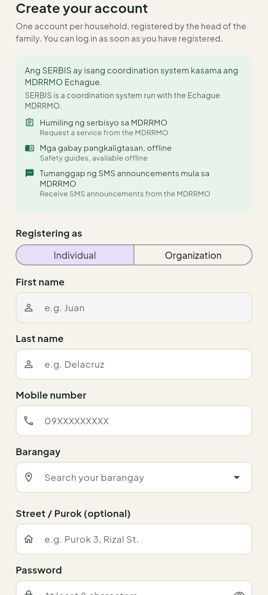{width=2.5in}

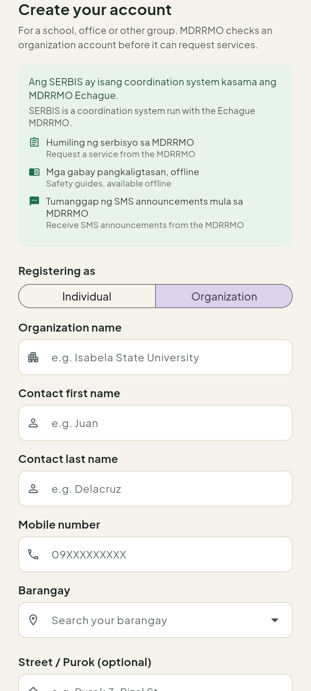{width=2.5in}

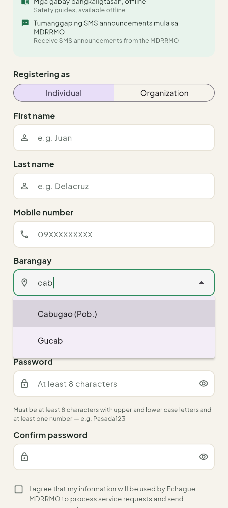{width=2.5in}

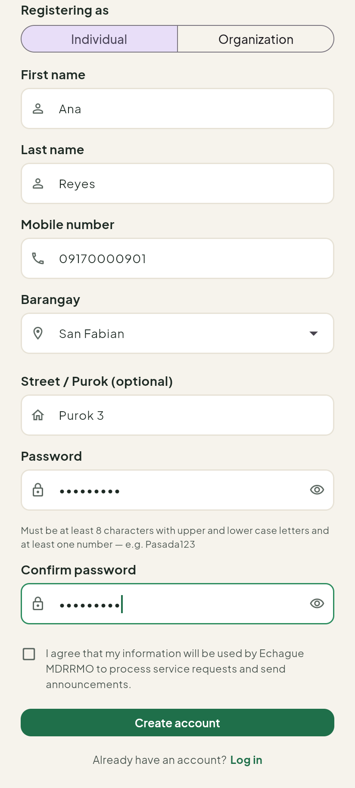{width=2.5in}

## Confirming your mobile number

After you tap **Create account**, MDRRMO sends a 6-digit code by text message.

1. Wait for the text message.
2. Type the 6 digits in **Verification code**.
3. Tap **Verify**.

If no text arrives, wait until the countdown **Resend code in …s** ends (about one minute). Then tap **Send a new code**. Your account is only created after you enter the code.

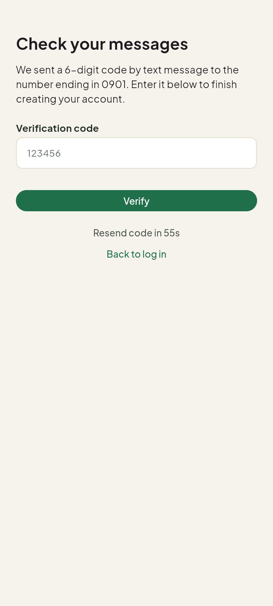{width=2.5in}

## If you registered an Organization

An organization account must be approved by MDRRMO before it can ask for services.

- Your Home screen shows **Awaiting MDRRMO approval**.
- The service tabs show a card that says **Awaiting MDRRMO approval**.
- Tap **Check again** to see if MDRRMO has approved it.

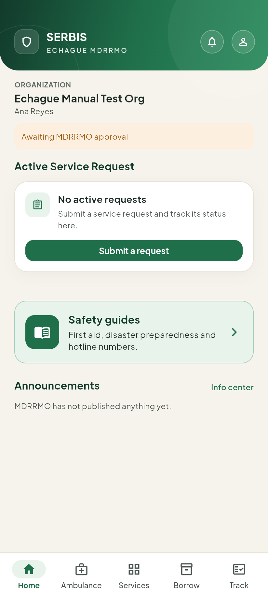{width=2.5in}

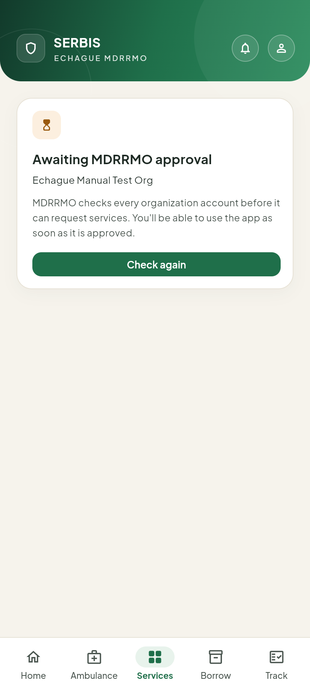{width=2.5in}

## Which services each account can use

Not every account type sees every service. This table shows the current settings.

| Service | Individual | Barangay | Organization |
|---|:---:|:---:|:---:|
| Ambulance/Medical Response | Yes | Yes | Yes |
| Road Clearing | Yes | Yes | Yes |
| Power Line Repair | Yes | Yes | Yes |
| Debris Removal | Yes | Yes | Yes |
| Animal Rescue | Yes | Yes | Yes |
| Sandbagging | Yes | Yes | Yes |
| Relief Goods Distribution | No | Yes | No |
| DRRM Trainings and Seminars | No | Yes | Yes |
| Simulation Drills / NSED | No | Yes | Yes |
| MDRRMO Certification | Yes | Yes | Yes |
| Others | Yes | Yes | Yes |
| Equipment borrowing | Yes | Yes | Yes |

MDRRMO can change these settings at any time. If a service is missing from your app, it is not open to your account type right now.

# Logging in and the Home screen

## Logging in

1. Type your **Mobile number**.
2. Type your **Password**.
3. Tap **Log in**.
4. MDRRMO sends a 6-digit code by text message. Type it in **Verification code** and tap **Verify**.

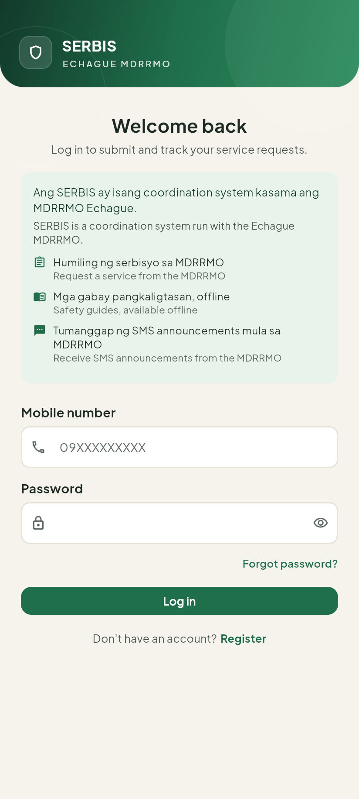{width=2.5in}

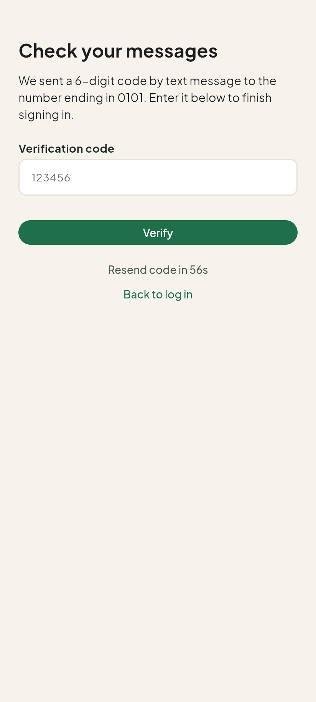{width=2.5in}

## Forgot your password

1. On the log-in screen, tap **Forgot password?**
2. Type your **Mobile number** and tap **Send code**.
3. Type the code from the text message and tap **Verify**.
4. Type a **New password**, type it again in **Confirm new password**, and tap **Change password**.

## The Home screen

At the top you see your account type and your name.

- **Active Service Request** shows your latest open request, with its status. Tap **View details** or **View all** to open it in Track. Tap **Cancel** to cancel it, if it can still be cancelled.
- **Need help now?** has shortcuts to **Medical Transport / Ambulance** and **Borrow Equipment**.
- **Safety guides** opens the Library.
- **Announcements** lists documents MDRRMO has published. Tap **Info center** to see them all.
- The bell at the top right opens **Notifications**. The round button next to it opens your profile.

At the bottom are five tabs: **Home**, **Ambulance**, **Services**, **Borrow** and **Track**.

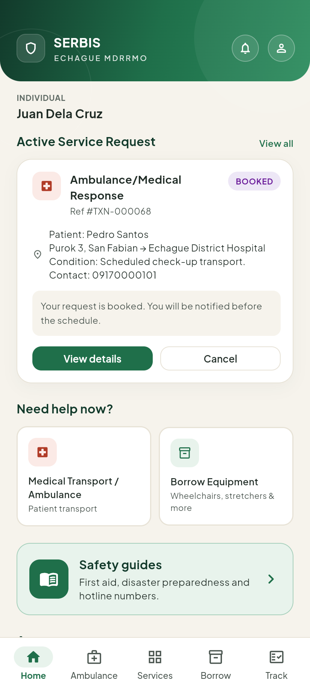{width=2.5in}

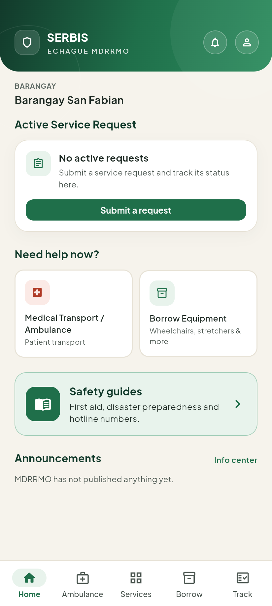{width=2.5in}

# Asking for a service

## The Services list

Tap **Services** at the bottom. The services are grouped under headings: **Infrastructure**, **Rescue**, **Relief**, **Programs** and **Other requests**. Each row shows the service name and a short description.

The list depends on your account type (see the table in Section 2).

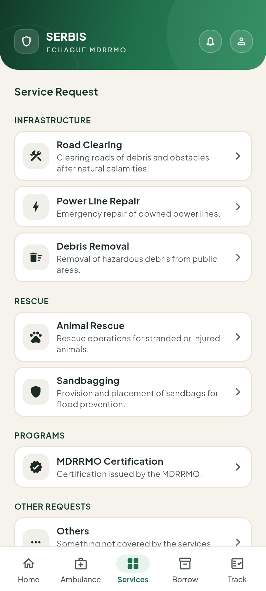{width=2.5in}

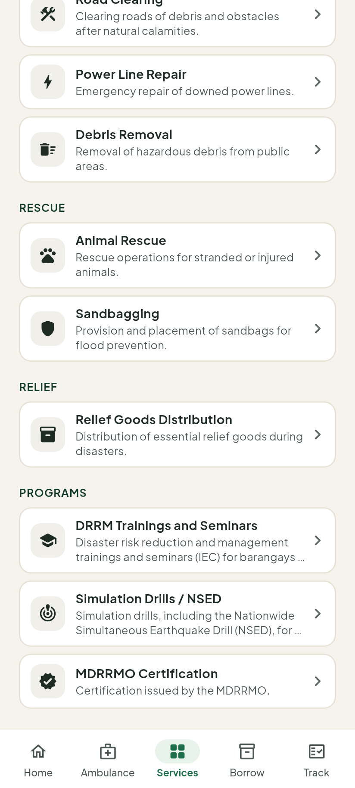{width=2.5in}

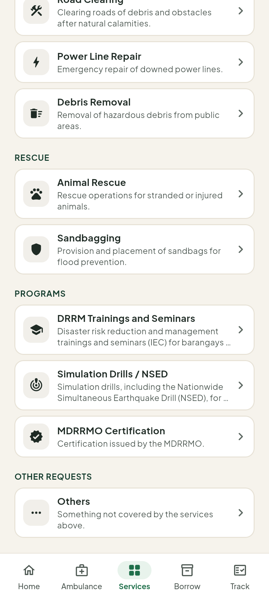{width=2.5in}

## Filling in a request

This example uses **Animal Rescue**. Other services ask for different details, but the steps are the same.

1. In **Services**, tap the service you need.
2. Fill in the details. For Animal Rescue, type what you need and where in **Details**.
3. Under **Valid ID (required)**, tap the box and choose a photo of a valid ID (JPG or PNG, up to 2 MB). The box turns green and shows the file name.
4. If you want, add a **Site photo (optional)** and a **Landmark (optional)**.
5. Tap **Submit request**.

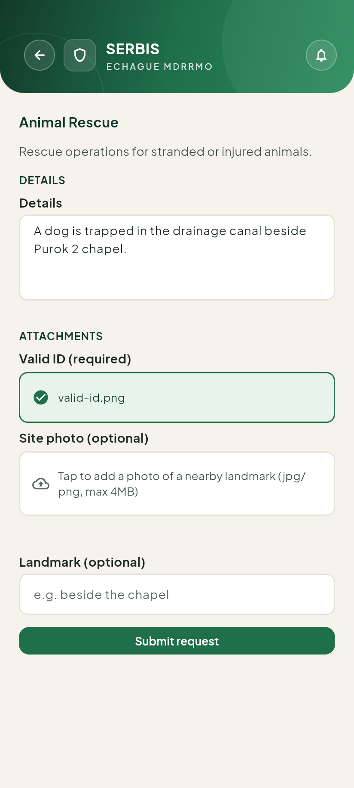{width=2.5in}

## After you submit

The app shows **Request submitted** and your reference number, like **TXN-000073**. Keep this number. MDRRMO uses it to find your request.

Tap **View in Track** to follow your request.

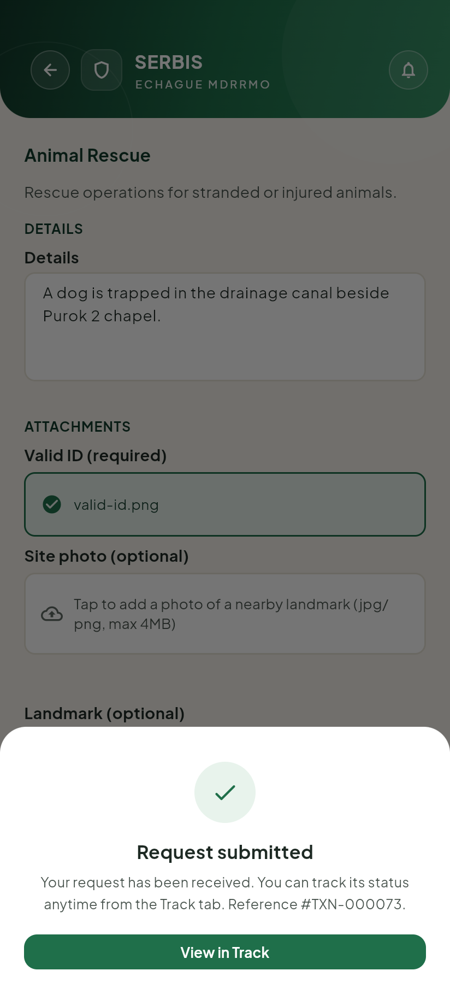{width=2.5in}

If the app shows **Your request wasn't sent. Your details are still here — tap Retry to send them again.**, check your internet and tap **Retry**.

# Booking an ambulance

Tap **Ambulance** at the bottom of the screen. The form has five parts: **Patient**, **Trip details**, **Condition**, **Patient / Relatives** and **When**.

At the top you see **Non-life-threatening use only**. If the patient's life is in danger, do not use this form. Tap **View emergency hotlines** and call.

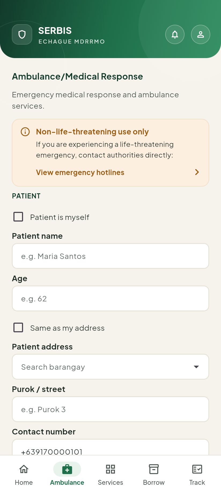{width=2.5in}

## Patient

1. If you are the patient, tick **Patient is myself**. Your name is filled in. You can still change it.
2. Otherwise, type the **Patient name**.
3. Type the patient's **Age**.
4. Set the **Patient address**:
   - If the patient lives at your address, tick **Same as my address**. Your barangay and street are filled in.
   - Or tap **Patient address** and start typing the barangay. Tap it in the list. Then type the purok or street in **Purok / street**.
   - If the patient lives outside Echague, choose **Other** in the list. The box below changes to **Full address**. Type the whole address there.
5. Check the **Contact number**. It is your number at first. Change it if MDRRMO should call someone else about the patient.

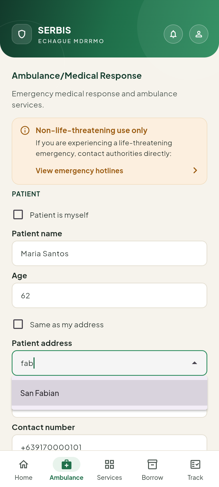{width=2.5in}

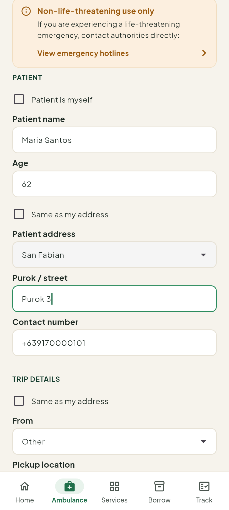{width=2.5in}

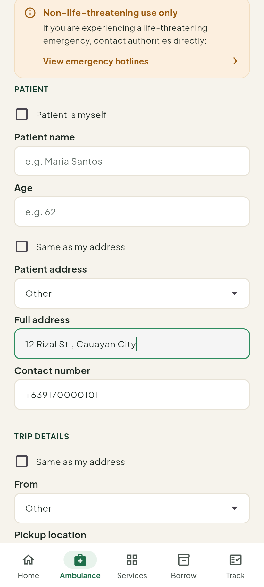{width=2.5in}

## Trip details

1. **From** is where the ambulance picks up the patient.
   - If the patient is at a hospital in the list, choose that hospital.
   - Otherwise leave **Other** and type the place in **Pickup location**.
   - Tick **Same as my address** to fill in your own address.
2. Type a **Landmark (optional)** near the pickup place, so the crew can find it. For example "Beside the chapel".
3. **To** is where the patient is going. Choose a hospital in the list. If it is not in the list, choose **Others** and type the place in **Destination**.

You can type in **From** and **To** to find a hospital faster.

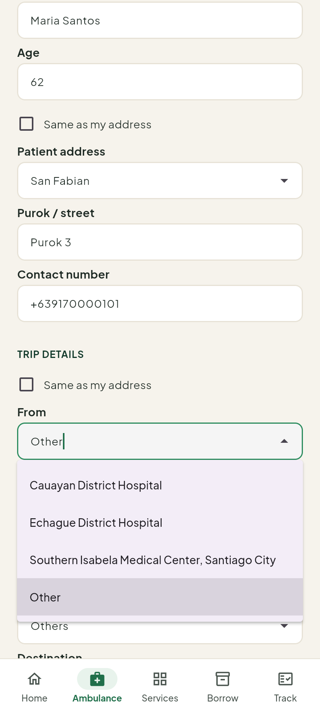{width=2.5in}

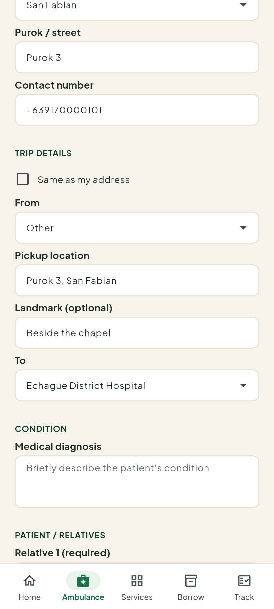{width=2.5in}

## Condition and relatives

1. In **Medical diagnosis**, write the patient's condition in a few words.
2. In **Relative 1 (required)**, type the name of a relative who will go with the patient.
3. To add a second relative, tap **Add relative**.

## When

- **As soon as possible**: MDRRMO sends the ambulance as soon as it can.
- **Scheduled**: you pick a date and time.

To schedule:

1. Tap **Scheduled**.
2. Choose the date and tap **OK**.
3. Choose the time and tap **OK**.

The time must be at least 1 hour from now. You can book up to 60 days ahead. If you pick a time too soon, the app says **Please pick a time at least 1 hour from now.**

After you pick a time, the app checks if an ambulance is free. It shows **At least one ambulance may be free at that time.** or **No ambulance may be free at that time yet. You can still submit — MDRRMO will confirm.** This is only a guide. MDRRMO confirms the booking.

To pick another time, tap **Change**.

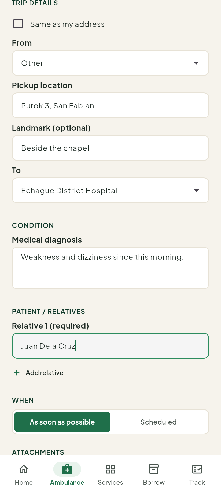{width=2.5in}

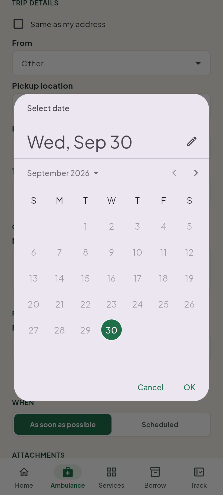{width=2.5in}

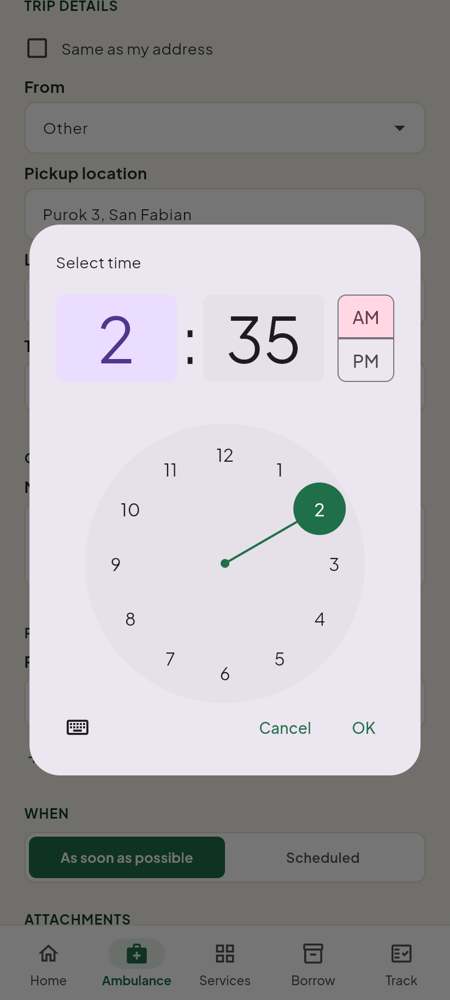{width=2.5in}

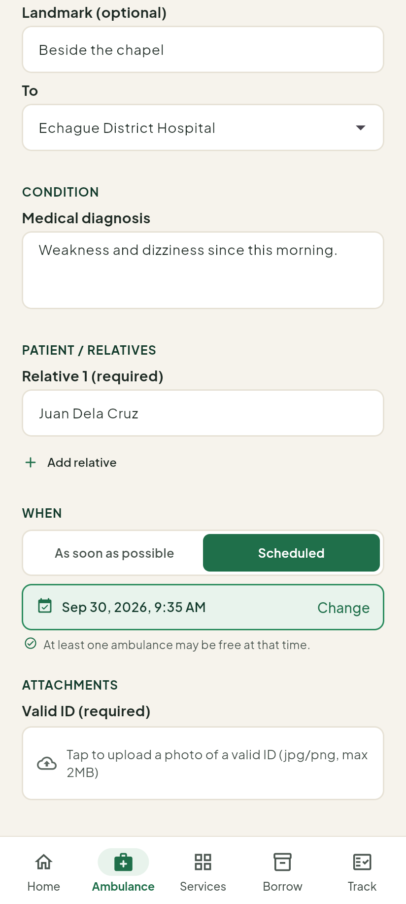{width=2.5in}

## Sending the booking

1. Under **Valid ID (required)**, attach a photo of a valid ID.
2. Tap **Submit request**.
3. Write down the reference number that appears.

The app will not send the booking without a patient name, a destination and at least one relative. It tells you which one is missing.

# Following your requests

Tap **Track** at the bottom. Every request you made is here, newest first. Each card shows the service, the reference number (**Ref #TXN-…**), the details you sent and the status.

Tap a status at the top (**All**, **Under review**, **Booked**, **Responding**, **Completed**, **Cancelled**, **Not approved**) to show only those requests.

Tap **View timeline** to see each step and its time. Tap **Hide timeline** to close it.

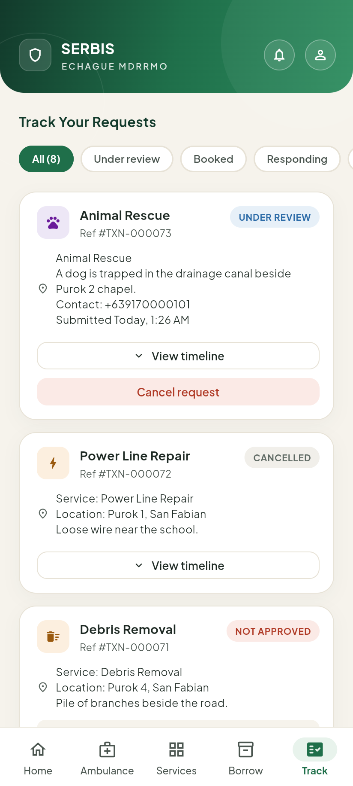{width=2.5in}

## What each status means

The app uses its own words. MDRRMO's word for the same status is in brackets.

| What the app shows | What it means |
|---|---|
| **Under review** (Pending) | MDRRMO has your request and is checking it. |
| **Booked** (Booked) | Your scheduled ambulance is booked. The card shows the date and time. You will be reminded before the schedule. |
| **Responding** (Responding) | MDRRMO is working on your request. For an ambulance, the crew is on the way. |
| **Approved** (Responding) | Shown instead of Responding for trainings, drills and certification: MDRRMO has approved it. |
| **Completed** (Resolved) | The request is done. |
| **Not transported** (Resolved) | The ambulance trip ended, but the patient was not brought to the hospital. The card shows the reason. |
| **Not approved** (Disapproved) | MDRRMO did not approve the request. The card shows the reason. |
| **Cancelled** (Cancelled) | The request was cancelled. |

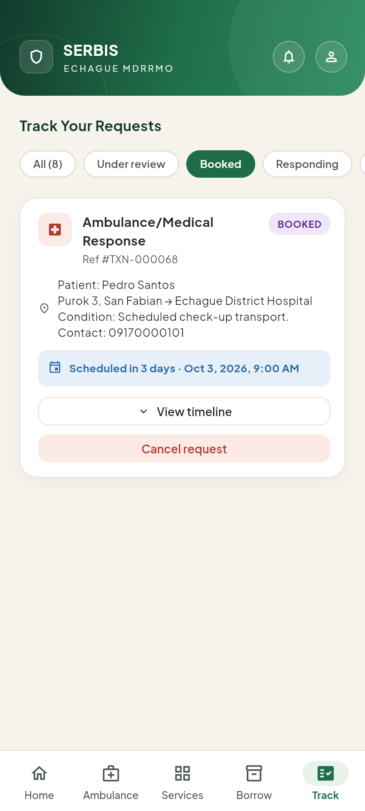{width=2.5in}

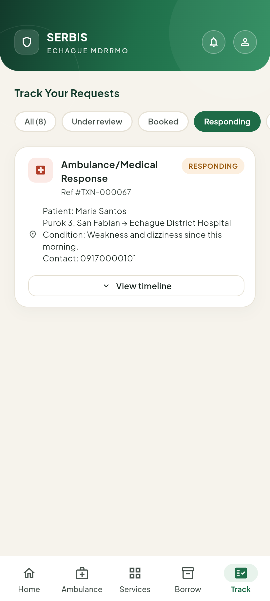{width=2.5in}

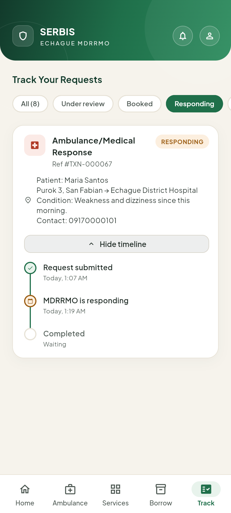{width=2.5in}

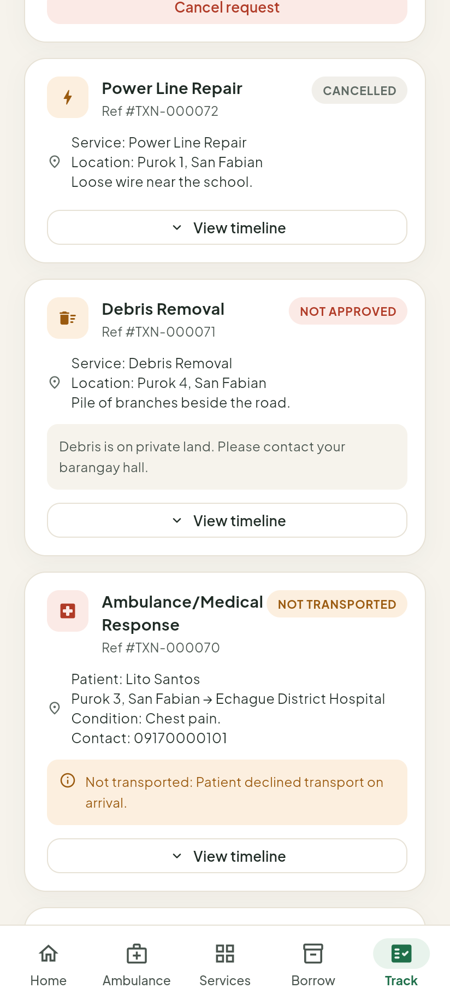{width=2.5in}

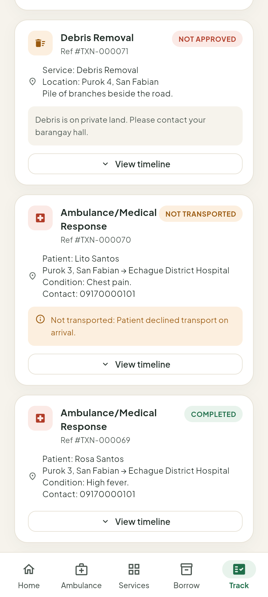{width=2.5in}

## Cancelling a request

You can cancel a request only while it is **Under review** or **Booked**. The **Cancel request** button appears only then.

You cannot cancel:

- once MDRRMO is **Responding**;
- a booked ambulance less than 2 hours before its scheduled time;
- once the ambulance crew has left the office.

In these cases, call MDRRMO instead.

To cancel:

1. On the request card, tap **Cancel request**.
2. The app asks **Cancel request?** Tap **Cancel request** again to confirm, or **Keep request** to go back.

A cancelled request cannot be undone.

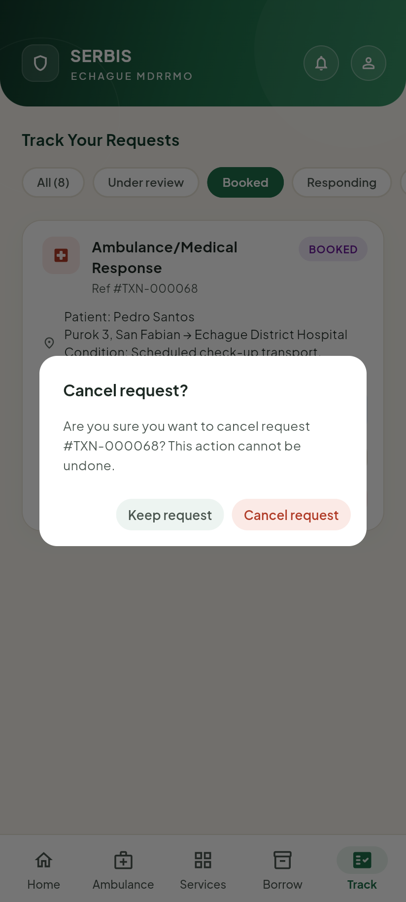{width=2.5in}

# Borrowing equipment

Tap **Borrow** at the bottom. The tab has two parts: **Available** and **My Requests**.

## Asking to borrow

1. In **Available**, find the item. Each item shows how many are available.
2. Tap **Borrow**.
3. Use **−** and **+** to set how many you need.
4. In **What do you need it for?**, write the reason. MDRRMO reads this before it approves.
5. Under **How will you get it?**, choose **Pickup** or **Delivery**. For **Delivery**, type the **Delivery address**.
6. Tap **Request this item**.

If the item you need is not in the list, scroll down to **Need something else?** and tap **Request**.

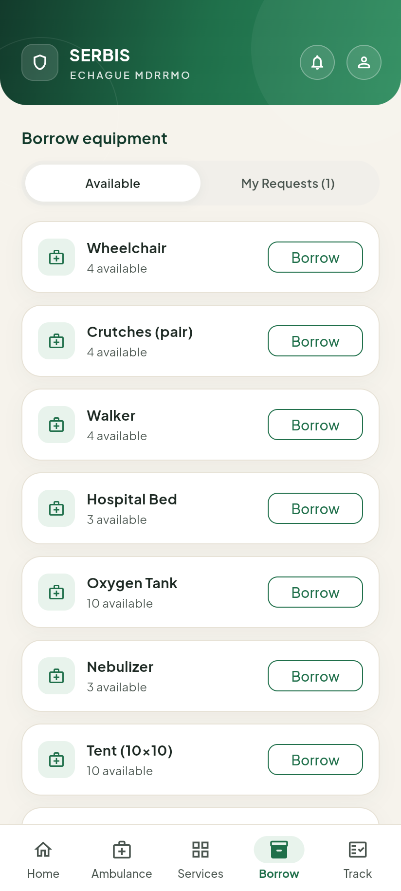{width=2.5in}

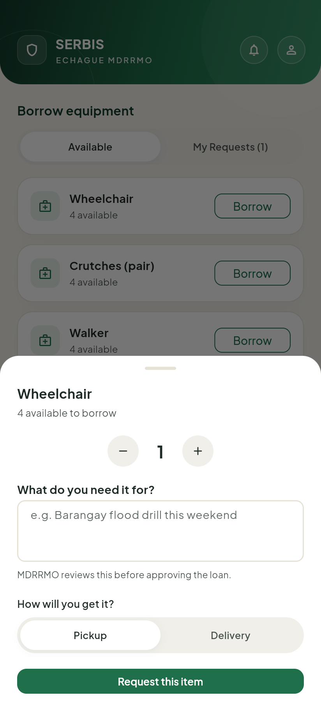{width=2.5in}

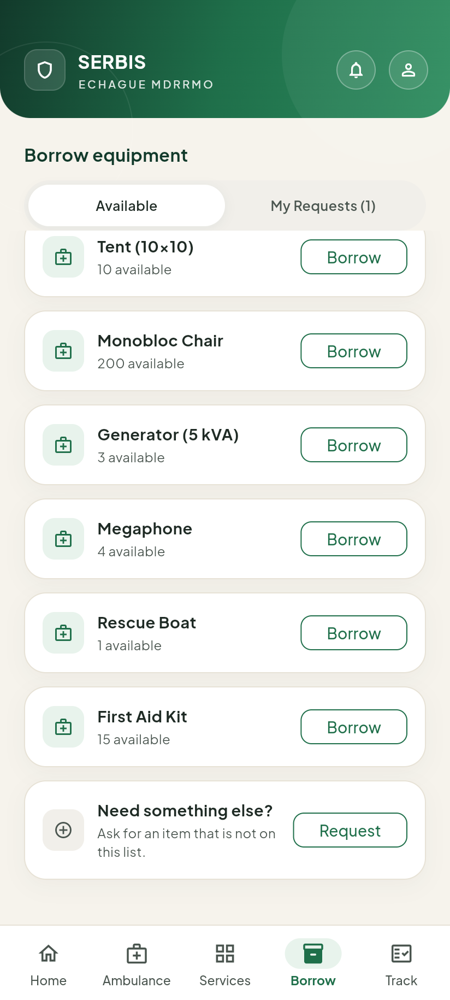{width=2.5in}

## Following your borrowing

Tap **My Requests** to see your borrowing requests and their status:

| What the app shows | What it means |
|---|---|
| **Pending review** | MDRRMO is checking your request. |
| **Approved — awaiting pickup** | Approved. Get the item, or wait for delivery. |
| **Released to you** | You have the item. |
| **Returned** | You gave the item back. |
| **Not approved** | MDRRMO did not approve it. |
| **Cancelled by you** | You cancelled it. |

You can tap **Cancel request** while it is **Pending review** or **Approved — awaiting pickup**. After the item is released, call MDRRMO instead.

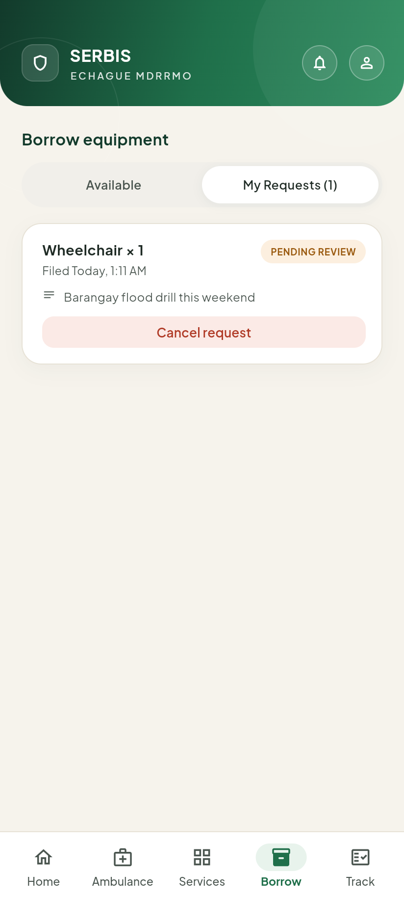{width=2.5in}

# Notifications, announcements and the Library

## Notifications

Tap the bell at the top right. You see:

- **MDRRMO advisories**: text messages MDRRMO sent to your barangay, like weather warnings;
- **Your requests**: the latest news on your own requests.

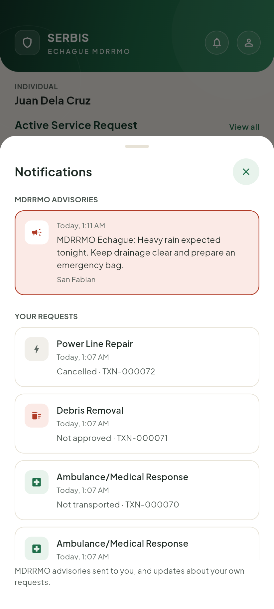{width=2.5in}

To receive MDRRMO text messages on your phone, turn on **MDRRMO text alerts** in your profile. When it is off, you will not receive any MDRRMO text blast.

## Announcements

The **Announcements** part of the Home screen lists the documents MDRRMO has published. If there are none yet, it says **MDRRMO has not published anything yet.** Tap **Info center** to open the Library.

## The Library

Tap **Safety guides** on the Home screen. The **Safety Library** has:

- **Emergency Hotlines**: phone numbers of the Echague Rescue Hotline, PDRRMO, ISELCO I, BFP and 911. Tap a number to call it.
- **Basic First Aid**: CPR, burns and wound care.
- **Disaster Preparedness**: what to do before, during and after a disaster, the Echague DRRM Plan and evacuation centers.
- **MDRRMO Documents**: documents MDRRMO has published.

Tap a guide to read it. Items marked **Saved** can be read without internet. Tap **EN** or **FIL** at the top of a guide to change its language.

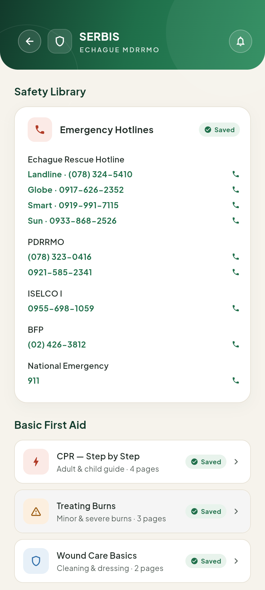{width=2.5in}

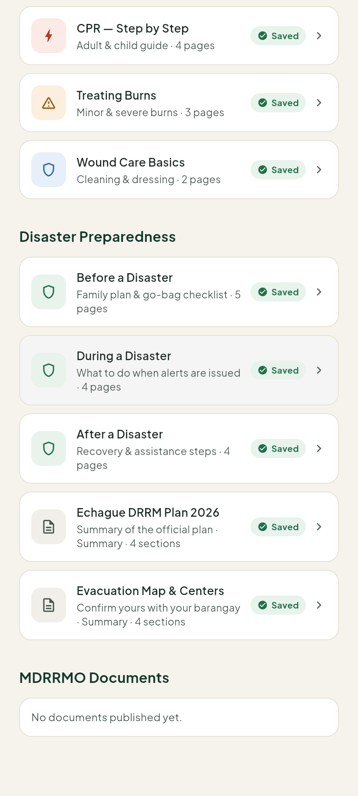{width=2.5in}

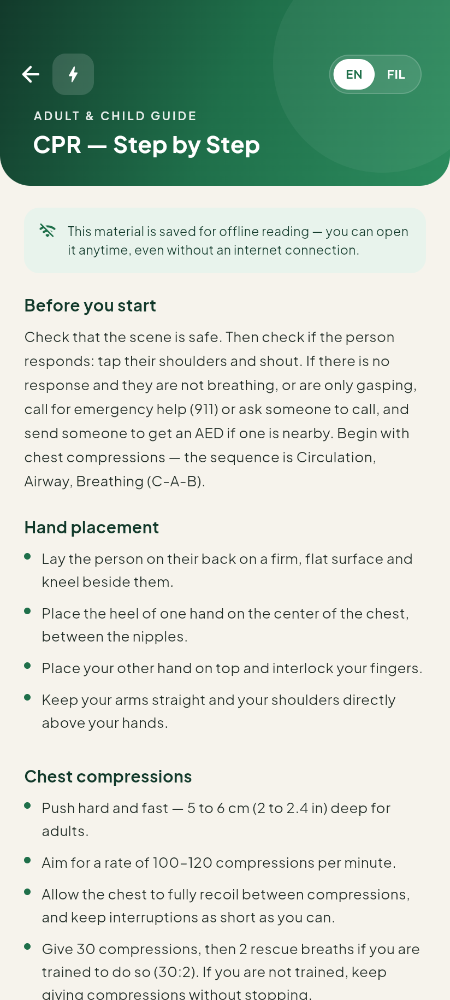{width=2.5in}

# Using the app without internet

Without internet:

- You **cannot send** requests, ambulance bookings or borrowing requests. The app does not keep them to send later. Wait until you are online again.
- You can still see the requests that were already loaded on your phone.
- The **Library** guides marked **Saved** and the **Emergency Hotlines** still work.

When the app cannot reach MDRRMO, it shows **No connection to MDRRMO. Requests can't be sent.**, with the time the information was **Last updated**. Screens that could not load show a message like **The list could not be loaded. Check your connection and try again.** Tap **Try again** when you are back online.

You can choose which guides are saved on your phone under **Offline materials** in your profile.

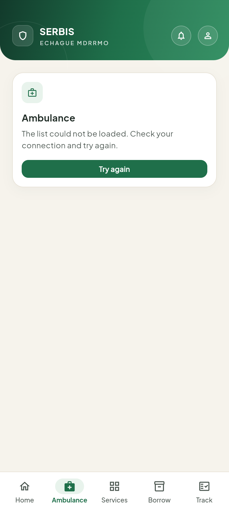{width=2.5in}

# Changing the language

1. Tap the round profile button at the top right.
2. Tap **Language**.
3. Tap **English** or **Filipino**.

The app's menus and buttons change language. The details you and MDRRMO typed stay as they were written.

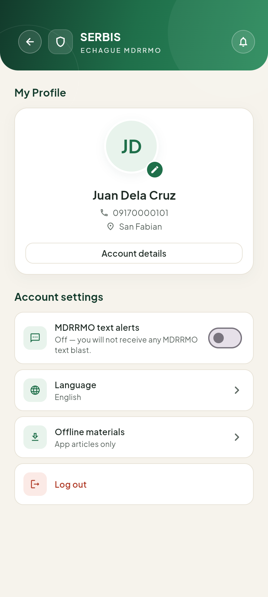{width=2.5in}

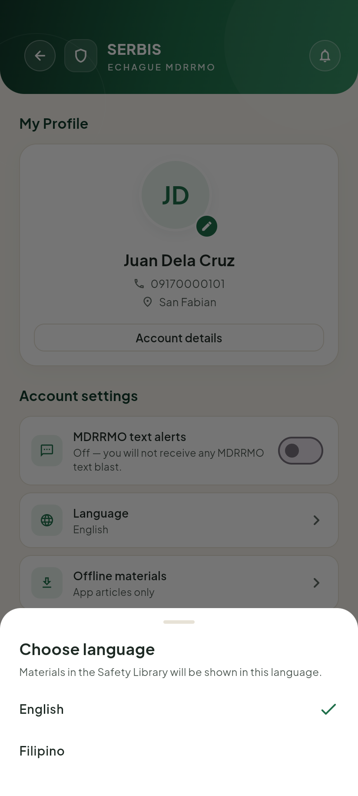{width=2.5in}

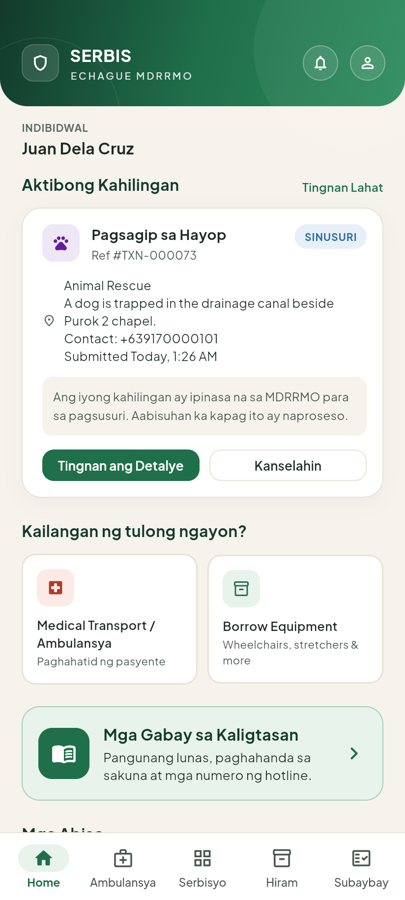{width=2.5in}

# Appendix A. Status words {-}

## Service requests and ambulance bookings

| English | Filipino | MDRRMO's word |
|---|---|---|
| Under review | Sinusuri | Pending |
| Booked | Nakabook | Booked |
| Responding | Tumutugon | Responding |
| Approved | Aprubado | Responding (trainings, drills, certification) |
| Completed | Natapos | Resolved |
| Not transported | Hindi naihatid | Resolved |
| Not approved | Hindi inaprubahan | Disapproved |
| Cancelled | Kinansela | Cancelled |

## Borrowing requests

The borrowing statuses are shown in English only, in both languages.

| What the app shows | MDRRMO's word |
|---|---|
| Pending review | Pending |
| Approved — awaiting pickup | Approved |
| Released to you | Released |
| Returned | Returned |
| Not approved | Denied |
| Cancelled by you | Cancelled |

# Appendix B. Troubleshooting {-}

## I did not get the code by text message

1. Check that the mobile number you typed is correct.
2. Wait about one minute until **Send a new code** appears, then tap it.
3. Check that your phone has signal.
4. If it still does not arrive, tap **Back to log in** and try again later, or contact MDRRMO.

## My request was refused

- **The app says something is missing.** Fill in the part it names. For every service, you must attach a valid ID photo. For an ambulance, you need a patient name, a destination and at least one relative.
- **The time is too soon.** A scheduled ambulance must be at least 1 hour from now.
- **I cannot cancel.** A request can be cancelled only while it is Under review or Booked, and a booking not within 2 hours of its time. Call MDRRMO.
- **It says the service is not available.** MDRRMO may have turned the service off. Choose another service or contact MDRRMO.
- **It shows an error after Submit.** The request was not sent. Check your internet and tap **Retry**.

## A service is not shown for my account

Each service is open only to some account types (see Section 2). MDRRMO sets this and can change it. If you need a service that is not shown, contact MDRRMO or ask your barangay hall.

## My organization account is still waiting

MDRRMO must approve every organization account. Tap **Check again** on the waiting card. If it takes long, contact MDRRMO.

## The app says it cannot connect

Check your internet connection, then try again. Requests are never sent while you are offline.
