<!--
SERBIS Admin Panel User Manual. Source for tools/build.py.
Conventions: "# " starts a main section (new right-hand page), "## " a task.
An image line is followed by its legend: "> **N** caption" lines, one per box.
A "part-break" comment line splits the printed booklet into part 1 and part 2.
-->

# About this manual

This manual is for MDRRMO Echague staff who use the SERBIS admin panel. It explains how to handle the requests residents send from the SERBIS mobile app, how to keep the vehicle, responder and equipment lists up to date, and how to reach residents by text.

SERBIS is for non-emergency services. Life-threatening emergencies still go through the hotlines.

Each task has numbered steps. Red numbered boxes on a picture match the numbers in the legend under it.

**What you see depends on your access.** A super admin sees every page. Other staff accounts see only the pages a super admin has given them. If a page in this manual is missing from your menu, you do not have access to it. Ask your super admin.

# Getting started

## Sign in

1. Open the SERBIS admin panel address in your web browser.
2. Type your username and password.
3. Click **Sign in**.

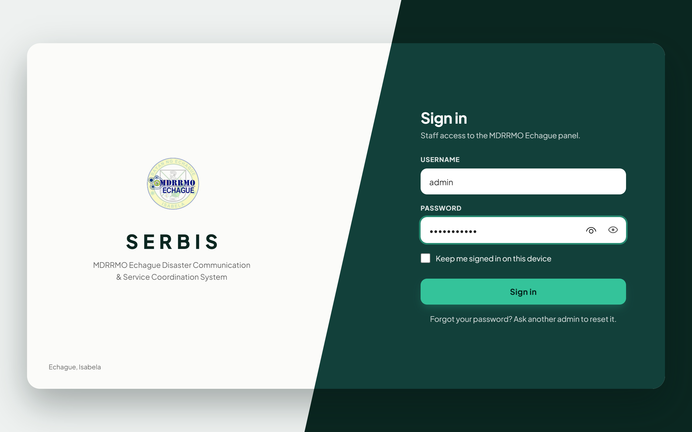

> **1** Your username
> **2** Your password
> **3** Sign in

SERBIS then texts a 6-digit code to the mobile number on your account.

4. Type the 6-digit code in the boxes.
5. Click **Verify**.

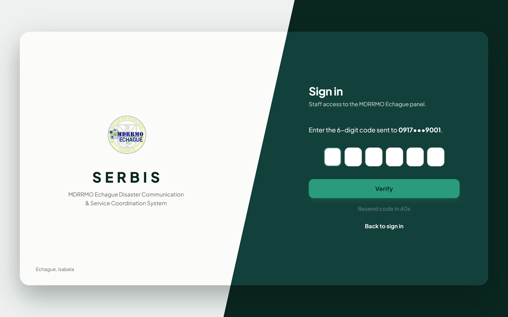

> **1** The 6-digit code from the text message
> **2** Ask for a new code
> **3** Finish signing in

If the text does not arrive within a minute, click **Resend code**. The button counts down 60 seconds before you can use it again.

## Set your own password the first time

A new staff account, and one whose password a super admin reset, both start on a temporary password. After you sign in with it, the panel shows **Set a new password** and opens nothing else until you save your own. The new password needs at least 8 characters, with upper and lower case letters and a number.

1. Type the temporary password.
2. Type a new password.
3. Type the new password again.
4. Click **Save and continue**.

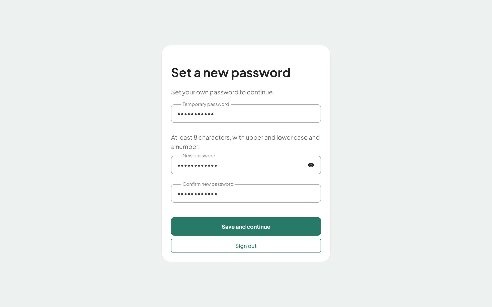

> **1** The password the super admin gave you
> **2** Your own new password
> **3** Type it again
> **4** Save it

## Find your way around

The menu on the left lists the pages you can open, in groups. The page you are on is highlighted. A number beside **Resident Requests**, **Ambulance Dispatch**, **Equipment Borrowing** and **Accounts** counts what is waiting for you there (Pending requests; Pending ambulance requests and Booked requests with no unit yet; Pending borrowing requests; Pending accounts), and it updates by itself.

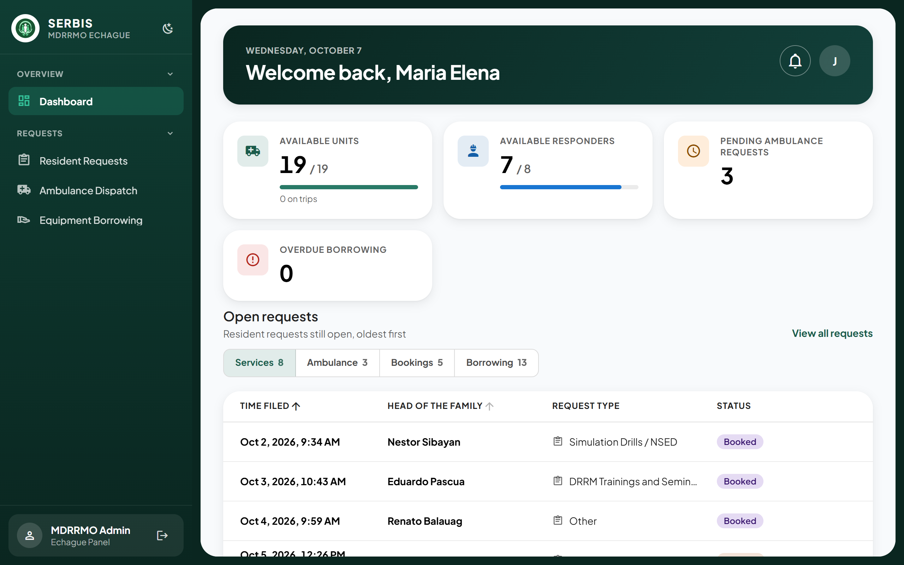

> **1** The pages you can open
> **2** Where you are now
> **3** System notices
> **4** Your account and Sign out

## Sign out

1. Click **Sign out**, the arrow next to your name at the bottom of the menu.
2. Click **Logout** to confirm.

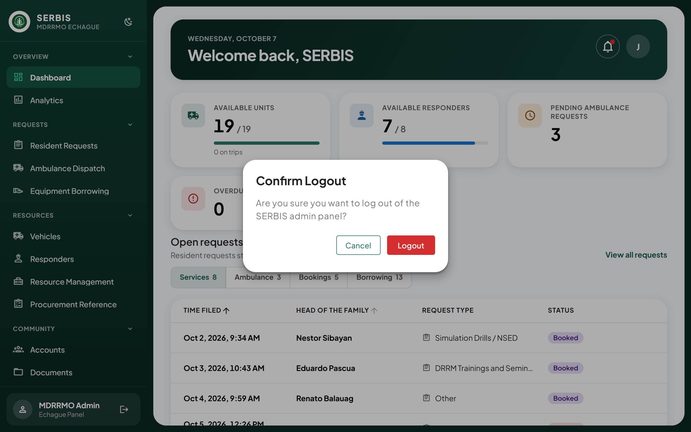

> **1** Confirm signing out

# Check today's work

## Read the dashboard

The dashboard shows what needs attention now: available units and responders, pending ambulance requests and overdue borrowing. Below the figures, the live board lists open requests. The dashboard updates by itself when a resident sends a request from the app, about every 30 seconds.

If you can open **Accounts**, two more things show:

- **Pending accounts**: accounts that registered and are waiting for you to activate them. Click the card to open **Accounts** showing only pending accounts.
- **Awaiting activation** in the bell: the same count, with how many are organizations. Click it to open the same list.

1. Click **Dashboard** in the menu.
2. Click a tab to switch boards.
3. Click a row to open that request on its own page.

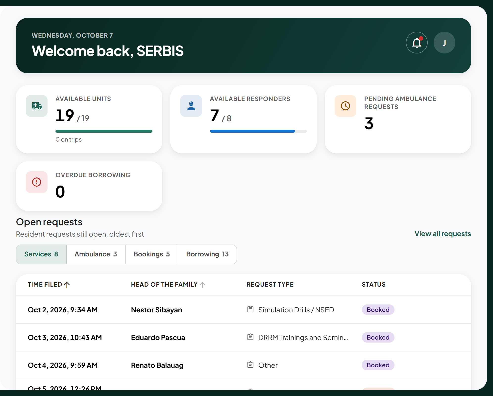

> **1** Today's figures
> **2** Switch between boards
> **3** How long it has waited
> **4** A request waiting for you

## Look at trends in Analytics

1. Click **Analytics**.
2. Click a period: **This month**, **This quarter**, **This year**, **All time** or **Custom**.
3. Optional: limit the report to one or more barangays or services.

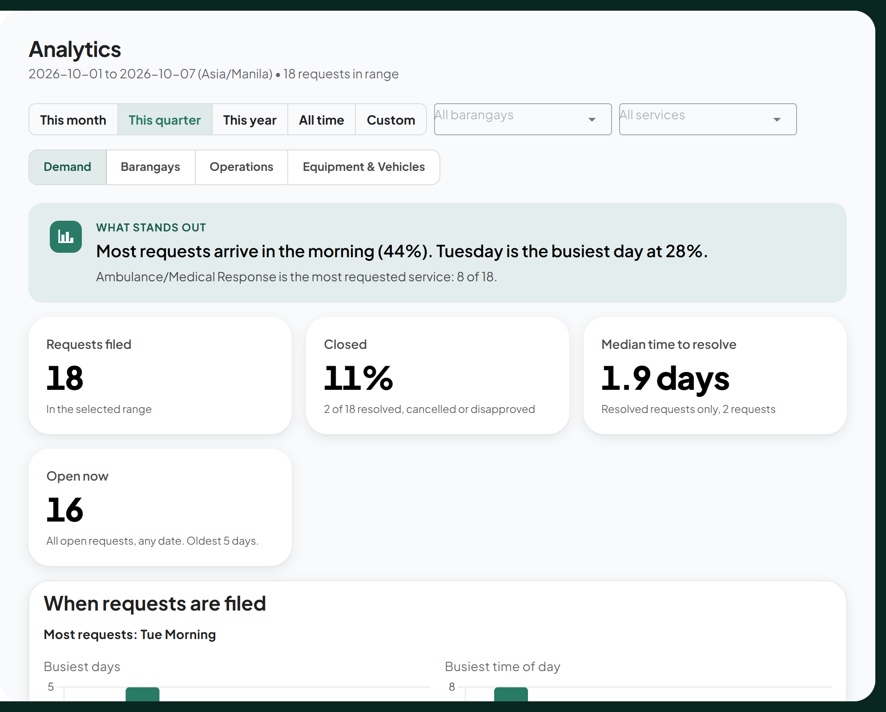

> **1** Period to report on
> **2** Limit to one barangay
> **3** Limit to one service

Each section can show a chart or the table of figures behind it.

4. Click **Table** to see the numbers, or **Chart** to go back.

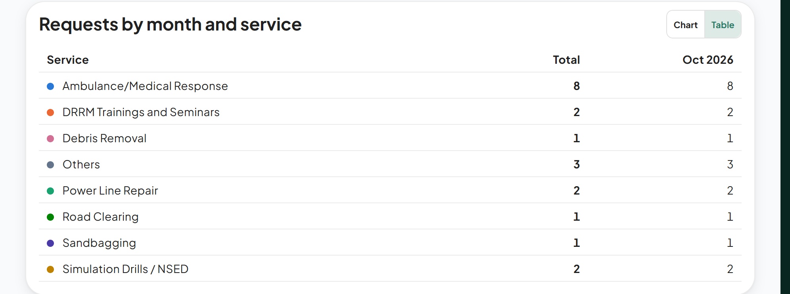

> **1** What this section measures
> **2** Switch chart and table
> **3** The figures behind the chart

# Handle resident requests

A resident request moves through these statuses:

- **Pending**: sent, waiting for MDRRMO.
- **Booked**: approved for a set date and time.
- **Responding**: approved, and the team is working on it.
- **Resolved**: done.
- **Disapproved**: refused, with a reason the resident can read.
- **Cancelled**: withdrawn by the resident.

## Find a request

1. Click **Resident Requests**.
2. Click a status tab, or use the search and filters.
3. Click the request to open it.

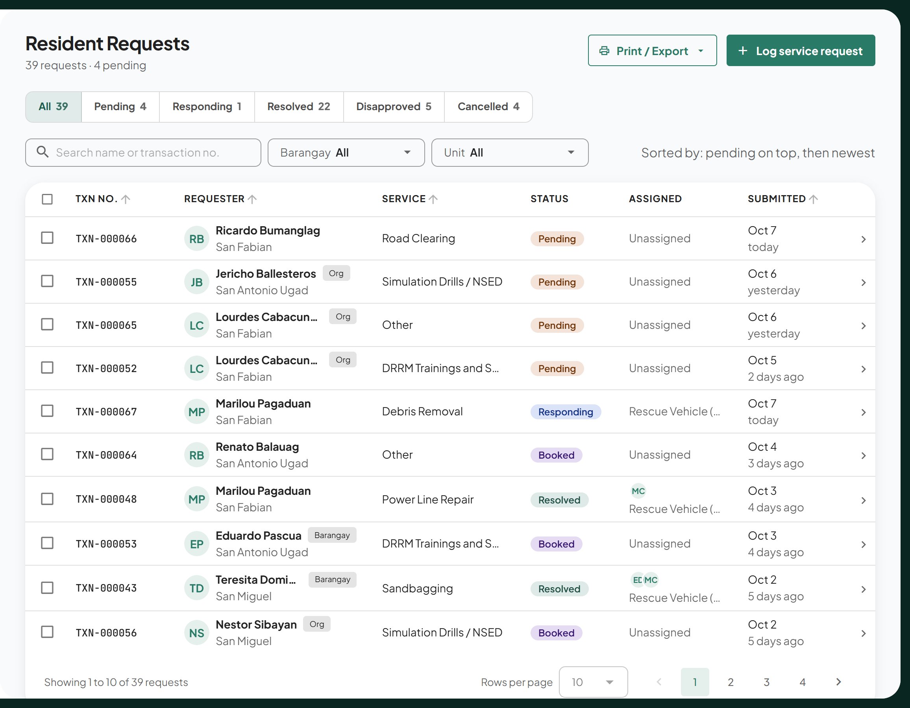

> **1** Requests by status
> **2** Narrow the list
> **3** Open a request

**New requests while you work.** The page checks for new requests about every 30 seconds. It does not move the list while you are working. A note shows above the list instead: **3 new requests · Show** when residents have sent more, or **This list has changed since it loaded · Refresh** when another staff member changed one. Click **Show** or **Refresh** to load them.

## Review a request

Click a request to open its panel on the right. It shows who sent the request, what they need, the photos, and the unit and responders to send.

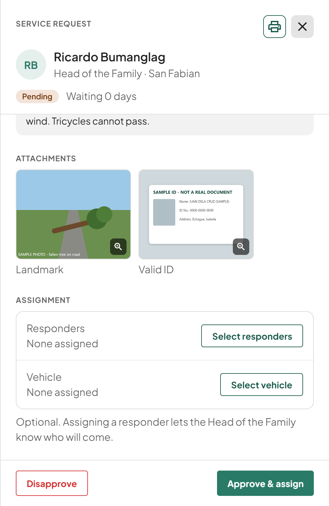

> **1** Who filed it
> **2** What they need
> **3** Unit and responders to send
> **4** Approve or disapprove

## Approve and dispatch

Use this when a unit and responders go out for the request.

1. Open the Pending request.
2. Under **Assignment**, click **Select vehicle**. The panel changes to **Assign to this request**.
3. Tick a vehicle. The list shows only free units of the types set for this service on the Service Vehicles page.
4. Click the **Responders** tab and tick the responders. Only available responders can be ticked.
5. Click **Done**.
6. Click **Approve & assign**.
7. In **Approve and dispatch**, click **Approve & dispatch**. You can click **Add a note** for the Head of the Family first.

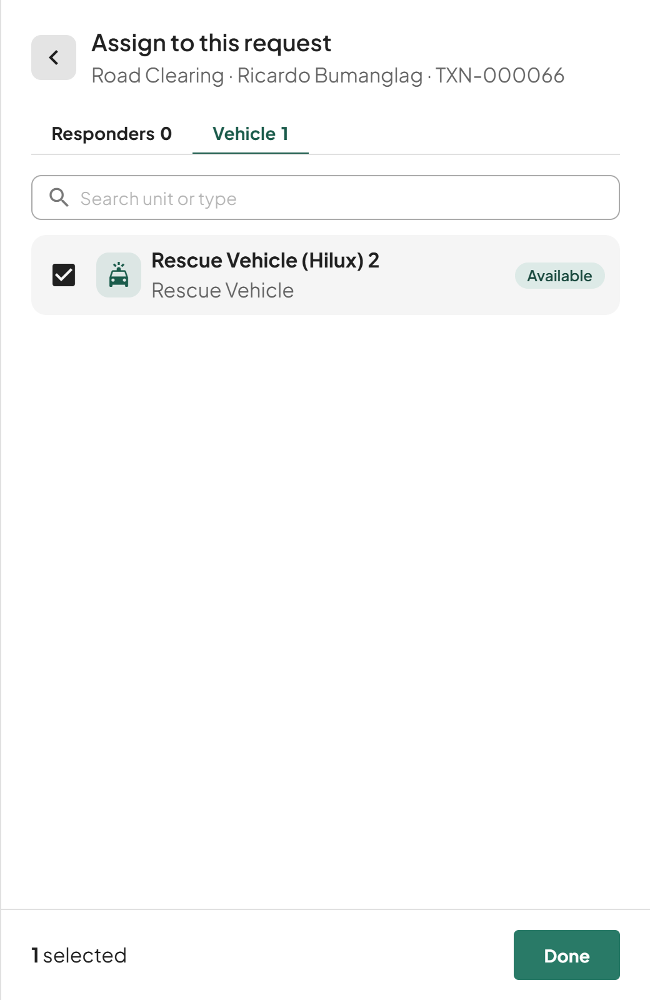

> **1** Pick a unit
> **2** Pick the responders
> **3** Back to the request

The request becomes **Responding** and the resident is notified.

## Approve without a vehicle

When no unit needs to go out:

1. Open the Pending request.
2. Click **Approve & assign** without selecting a vehicle.
3. In **Approve without a vehicle**, click **Approve**. You can click **Add a note** first.

The request becomes **Responding**. Trainings, drills and certifications have no vehicle: their dialog is **Approve this request**, and the resident sees **Approved**.

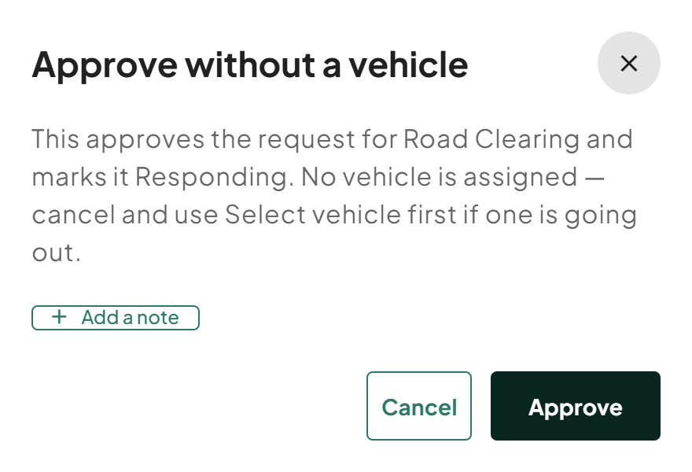

> **1** Approve when no unit is needed

## Disapprove a request

1. Open the Pending request.
2. Click **Disapprove**.
3. Type the reason. The resident sees it in the app.
4. Click **Disapprove request**.

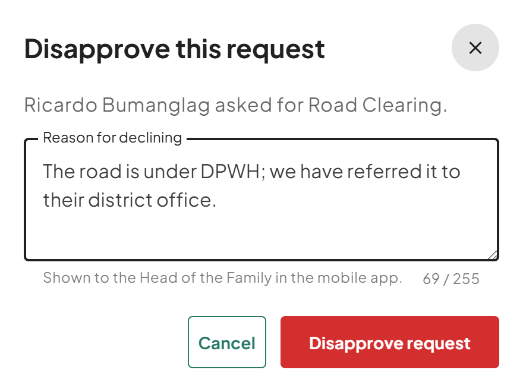

> **1** Why (the resident sees this)
> **2** Confirm

## Mark a request resolved

1. Open the Responding request.
2. Click **Mark as resolved** when the work is done.
3. Click **Resolve permanently**. A resolved request cannot be changed back, and its unit and responders are freed.

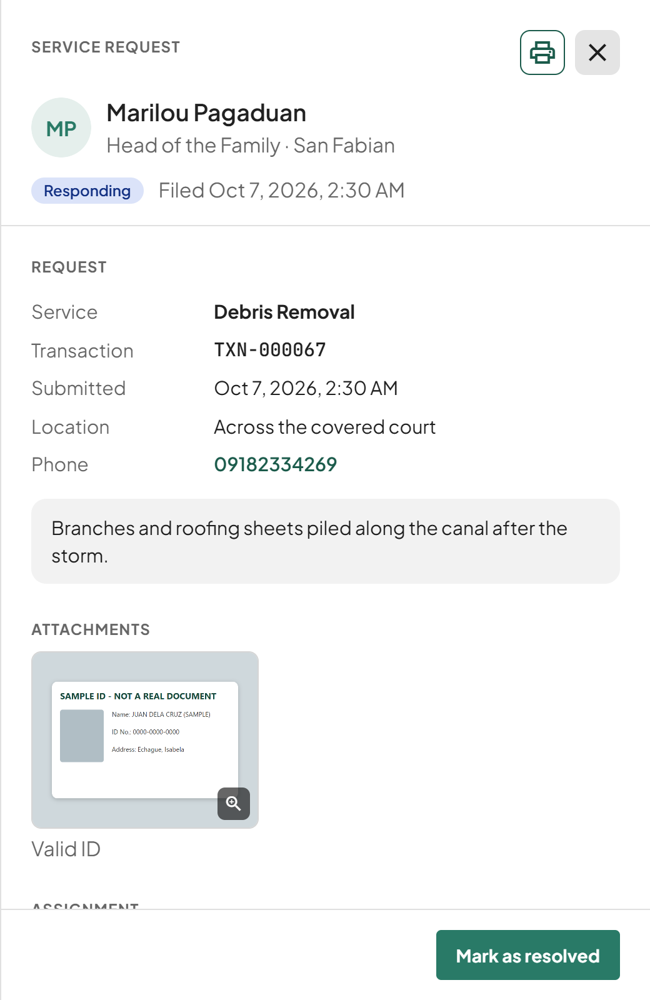

> **1** Work in progress
> **2** Mark the work done

## Record a walk-in request

Use this for a request made at the office or by phone.

1. Click **Log service request**.
2. Choose **Registered Head of the Family** and pick the person, or **No account** and type their name and contact number.
3. Choose the service.
4. Type the description. It is required.
5. Click **File request**.

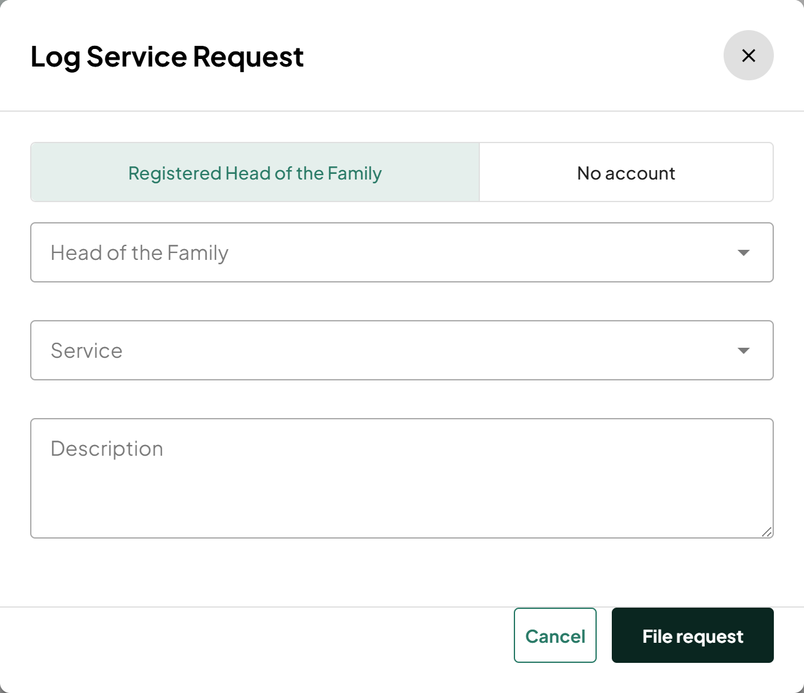

> **1** Is the person registered?
> **2** What they need
> **3** Details
> **4** Save the request

## Print or export a list

1. Click **Print / Export** above the list, then **Export all … matching** (or **Print all … matching**). To export only some rows, tick them first and click **Export selected**.
2. Click **Print / PDF**, **CSV** or **XLSX**.
3. Choose the columns and the sort order. For **Export all**, you can also set a date range.
4. Click **Export** (or **Print**).

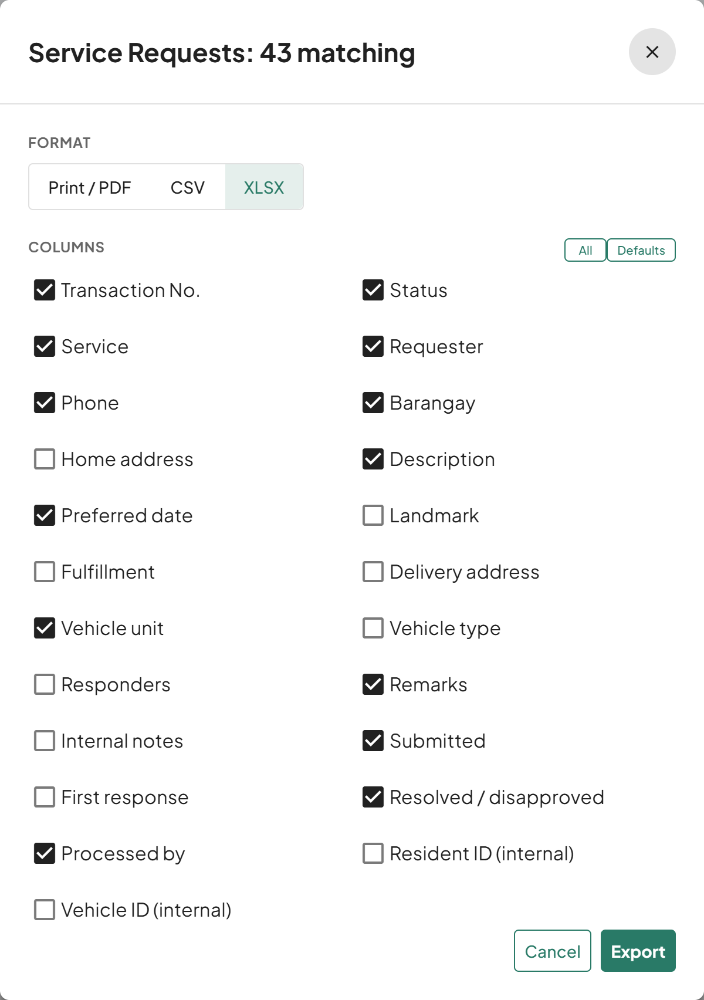

> **1** Choose the output
> **2** Columns to include

# Dispatch the ambulance

Ambulance requests have their own page, **Ambulance Dispatch**. A request for "now" arrives as **Pending** and becomes **Responding** when you approve and dispatch it. A request for a later date and time arrives already **Booked**: the time is held, you assign a unit before the trip, and it becomes **Responding** when you dispatch it.

New requests and trip records do not appear in the list while you work. A note shows above the list instead, as on **Resident Requests** (see **New requests while you work** under **Find a request**).

## Review an ambulance request

1. Click **Ambulance Dispatch**.
2. Click the request.
3. Check when it was sent, the route and the patient.

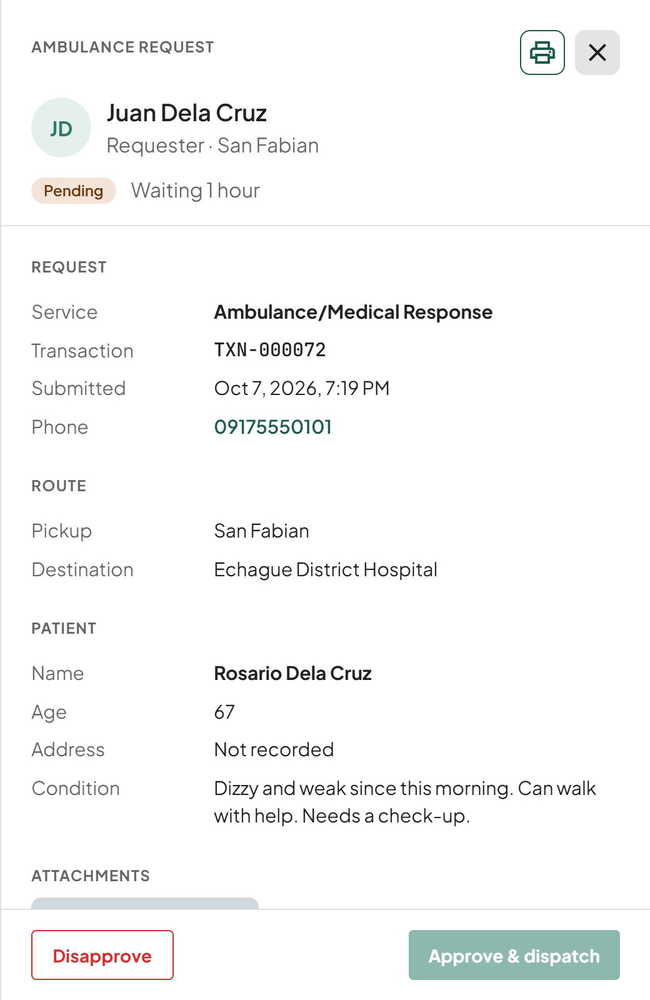

> **1** When it was sent
> **2** From and to
> **3** Who is being carried
> **4** Approve and send the unit

## Approve and dispatch a request for now

1. Open the Pending request.
2. Under **Assignment**, click **Select unit**.
3. Choose an ambulance unit. Only free units are listed; busy units are hidden.
4. Click **Done**.
5. Click **Approve & dispatch**. It stays greyed out until a unit is chosen.
6. In **Approve and dispatch**, click **Approve & dispatch**. You can click **Add a note** for the Head of the Family first.

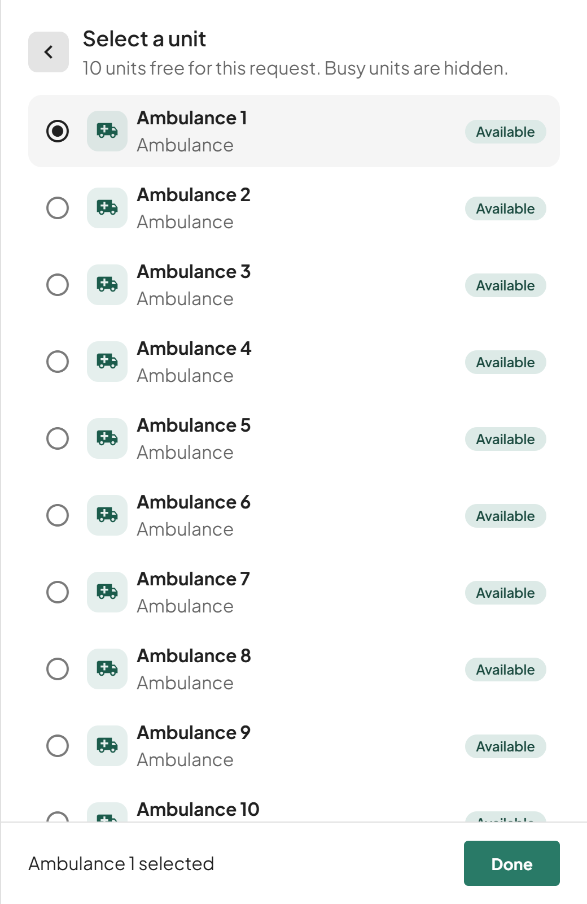

> **1** Ambulance units
> **2** Free for this request
> **3** Back to the request

The request becomes **Responding** and a trip record is started on the **Trip logs** tab.

## Assign a unit to a booking

1. Open the Booked request.
2. Click **Select unit** beside **Assignment**.
3. Choose a unit. Only units free at the booked time are listed.
4. Click **Done**. The unit is saved at once and the request stays **Booked**. To change it later, click **Reassign**.

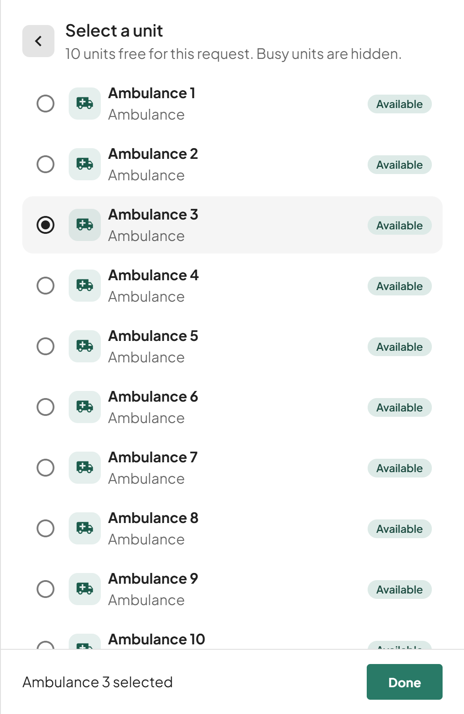

> **1** Only free units are listed
> **2** The unit you picked
> **3** Save it

## Dispatch a booking

When the unit leaves for a Booked trip:

1. Open the Booked request.
2. Click **Dispatch**. It stays greyed out until a unit is assigned.
3. The **Trip logs** tab opens a new trip record filled in from the booking. Check it and click **Save trip record**.

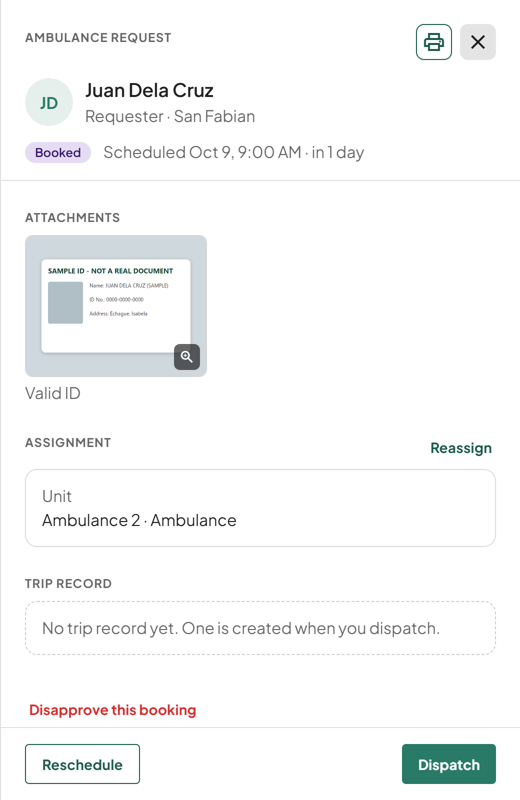

> **1** The unit assigned
> **2** Send it when the unit leaves
> **3** Refuse the booking

The request becomes **Responding**. To refuse a booking instead, click **Disapprove this booking**.

## Change the time of a booking

1. Open the Booked request.
2. Click **Reschedule**.
3. Set the new start and end.
4. Type the reason for the change. The resident sees it.
5. Click **Reschedule**.

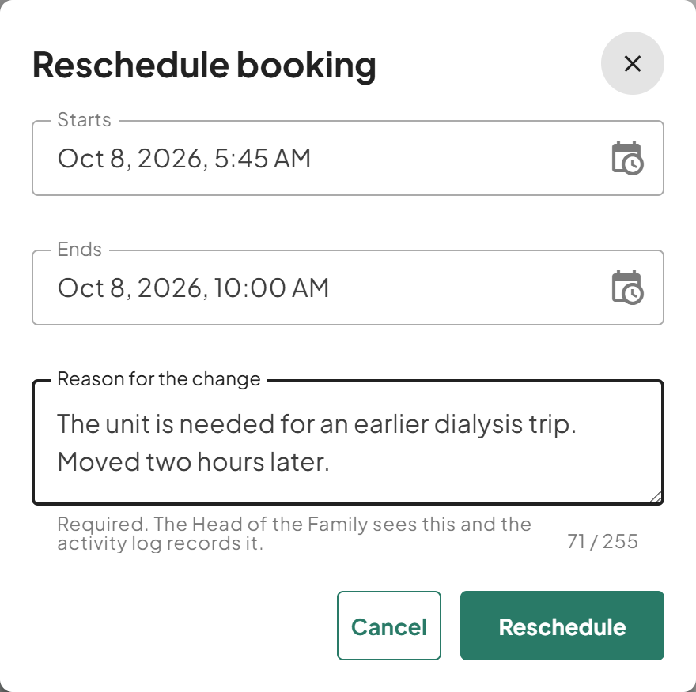

> **1** New start
> **2** New end
> **3** Why it moved (the resident sees this)
> **4** Save the new time

## Check the ambulance schedule

1. Click **Day view** on the Ambulance Dispatch page.
2. Click **Day** or **Month**.
3. Click **Today** to come back to the current day.

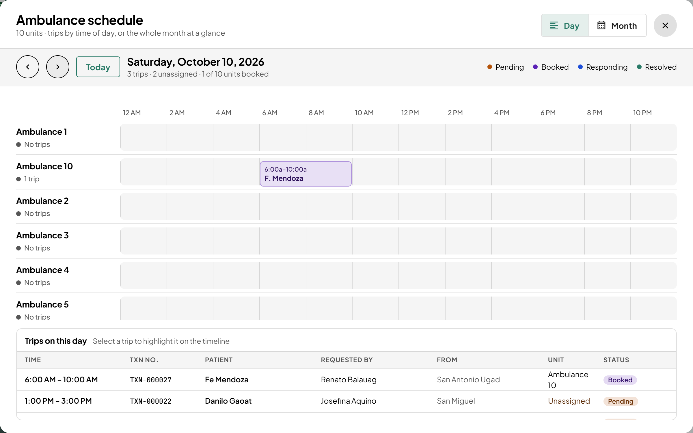

> **1** Change the view
> **2** Jump to today
> **3** One booked trip
> **4** What the colours mean

## Fill in the trip log

Fill in the log as the trip happens. You can save part of it and come back later.

1. Open the **Trip logs** tab.
2. Click the trip, then click **Complete trip log** (or **Update trip log** once a departure time is saved).
3. Enter the departure and arrival times.
4. Enter the odometer readings.
5. If the patient was not carried, tick **Did not reach destination** and type the reason.
6. Under **Crew**, add the driver.
7. Click **Save trip log**.

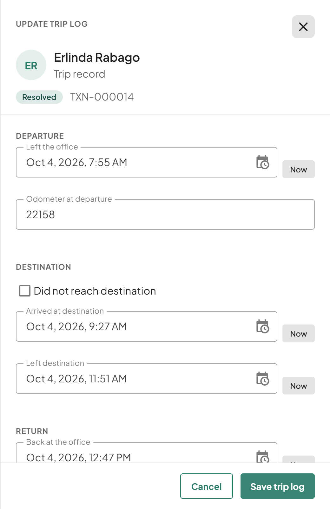

> **1** Times of each leg
> **2** Meter readings
> **3** Only if the patient was not carried
> **4** Save

An ambulance request can be marked resolved only when its trip log has a driver and an arrival time, or a reason it did not arrive.

## Print the conduction request form

1. Open the **Trip logs** tab.
2. Click the trip. Its panel opens on the right.
3. Click **Print** in the panel.
4. Print from the window that opens.

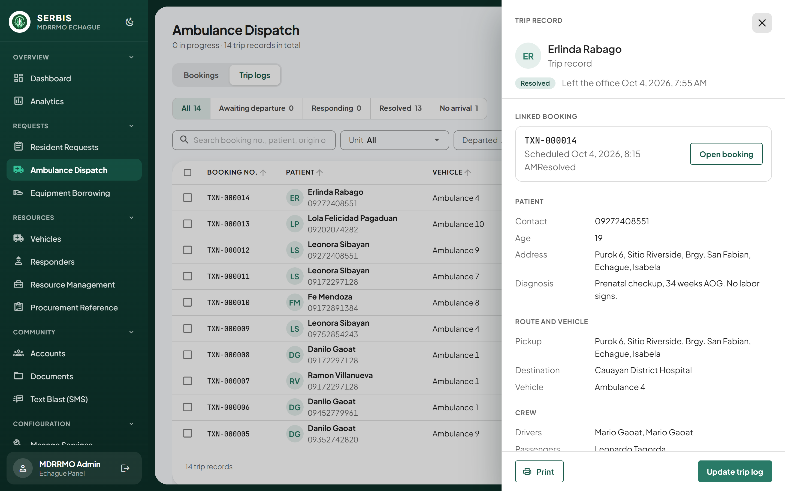

> **1** One trip
> **2** Print its conduction form

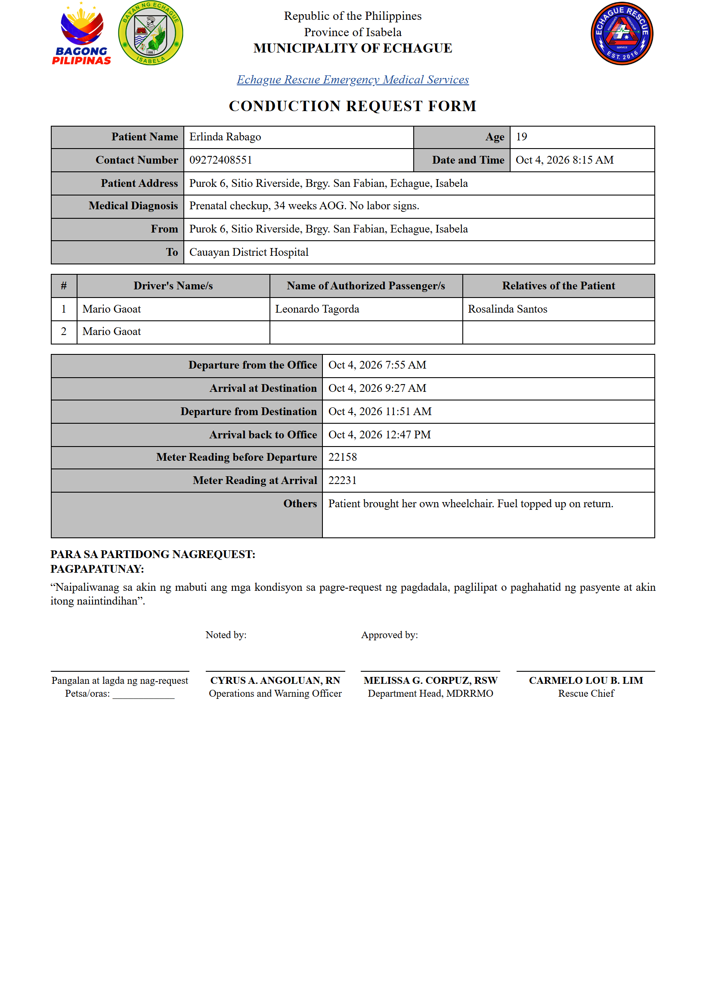

> **1** Patient and route
> **2** People on the trip
> **3** Times and meter readings
> **4** Signatures

# Lend equipment

A borrowing request moves through **Pending**, **Approved**, **Released** and **Returned**. It can also end as **Denied**, or **Cancelled** by the resident. Stock goes down when an item is released and back up when it is returned.

New borrowing requests do not appear in the list while you work. A note shows above the list instead, as on **Resident Requests** (see **New requests while you work** under **Find a request**).

## Review a borrowing request

1. Click **Equipment Borrowing**.
2. Use the equipment and barangay filters if the list is long.
3. Click the Pending request.

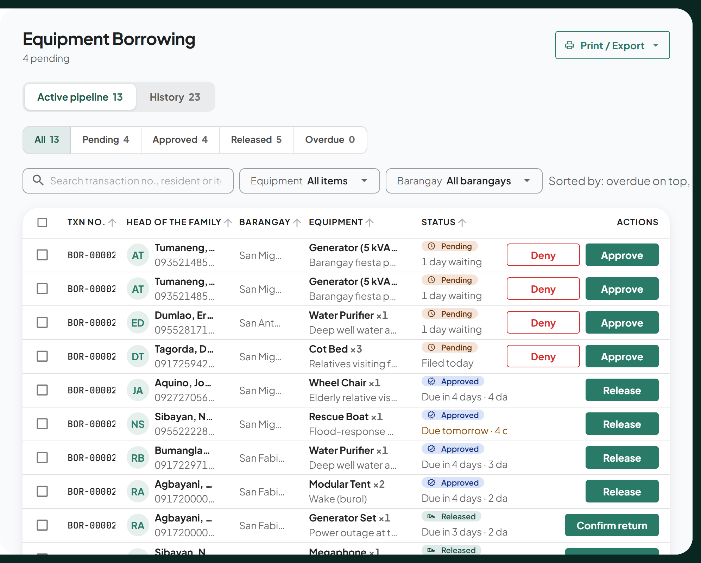

> **1** Limit to one item
> **2** Limit to one barangay
> **3** A request to review

## Approve a borrowing request

1. Check the item, the quantity and whether it is picked up or delivered.
2. Click **Approve request** in the panel, or **Approve** on the row.
3. Set **Due back on**, the date the item must be returned. It starts 7 days ahead and can be from tomorrow up to 7 days.
4. Click **Approve request**.

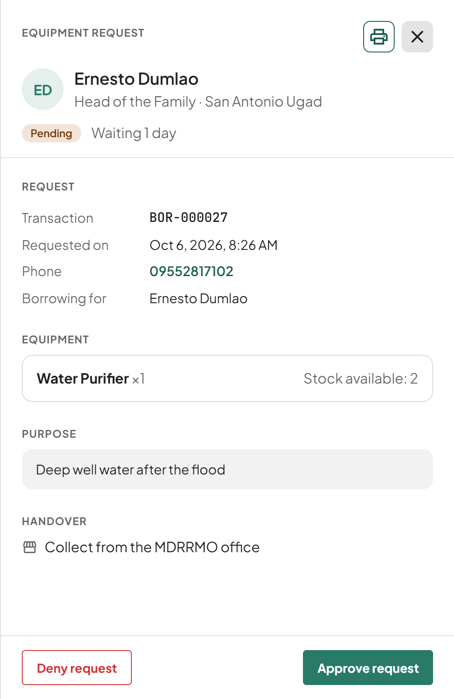

> **1** Who asked
> **2** What and how many
> **3** How it reaches them
> **4** Approve
> **5** Refuse

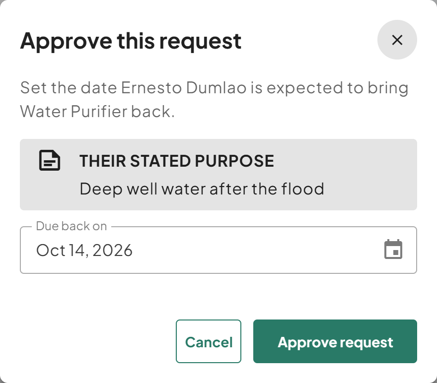

> **1** Return date
> **2** Approve

The resident's phone gets a reminder notification the day before the due date, or on the day if it was missed.

## Deny a borrowing request

1. Click **Deny request** in the panel, or **Deny** on the row.
2. Choose **Not available** or **Other reason**, and type the reason. The resident sees it. With **Not available**, the resident is asked whether they still need it once the item is back in stock.
3. Click **Deny request**.

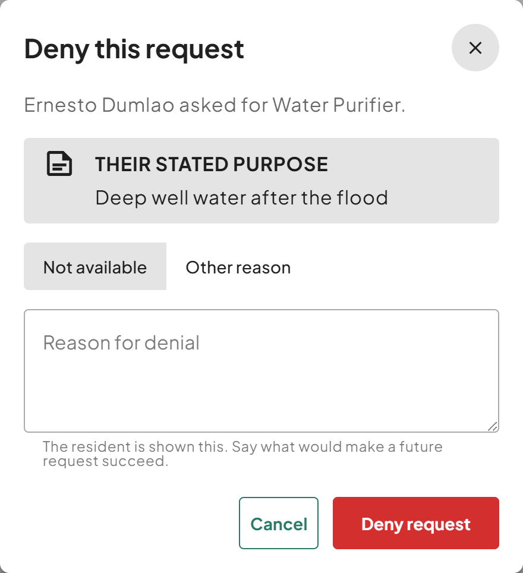

> **1** Why (the resident sees this)
> **2** Confirm

## Release the item

When the resident collects the item, or it is delivered:

1. Click **Release** on the row, or **Release to resident** in the request.

The item is released at once and stock goes down. There is no second step: the due date was set when the request was approved. A request for an item not in the inventory cannot be released.

## Record the return

1. Open the Released request.
2. Check the item against the condition photos.
3. Click **Confirm items returned** in the panel, or **Confirm return** on the row.
4. Choose **Good condition** or **Bad condition** and type a note. The note is required.
5. Click **Confirm return**. Stock goes back up. This cannot be undone.

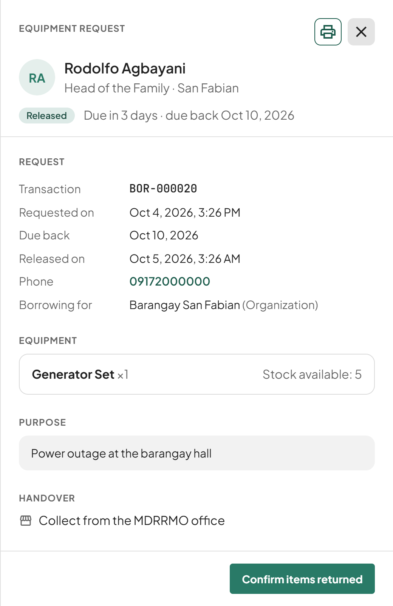

> **1** Photos taken at the counter
> **2** Record the return

<!-- part-break -->

# Keep resources up to date

## Add or change a vehicle

1. Click **Vehicles**.
2. Click **Add unit**, or **Edit** on an existing unit.
3. Type the unit name and choose its type.
4. Set the status. Choose **Maintenance** to take a unit out of service.
5. Click **Add unit** or **Save**.

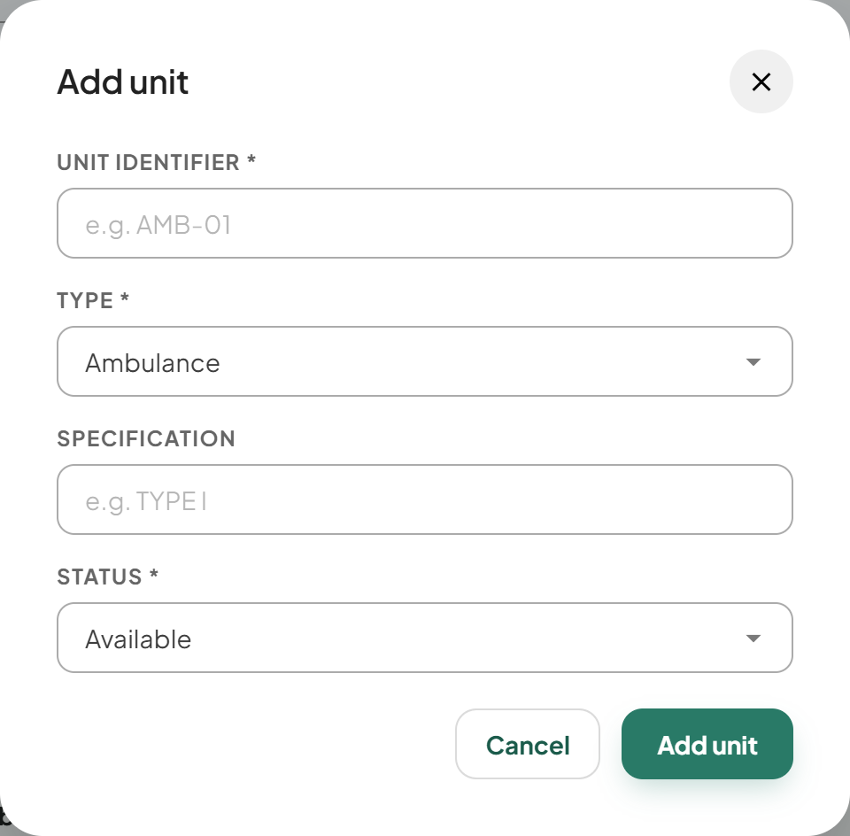

> **1** Name of the unit
> **2** Kind of vehicle
> **3** Model or notes
> **4** Available or Maintenance
> **5** Save

A unit cannot be deleted while it is dispatched, holds future bookings, or any request uses it. Set it to **Maintenance** instead.

## Add a responder

Responders do not sign in to SERBIS. Staff assign them to requests.

1. Click **Responders**.
2. Click **Add responder**.
3. Type the name and contact number, and choose the position: Team Leader, Assistant Leader, Logistics or Driver.
4. Click **Add responder**.

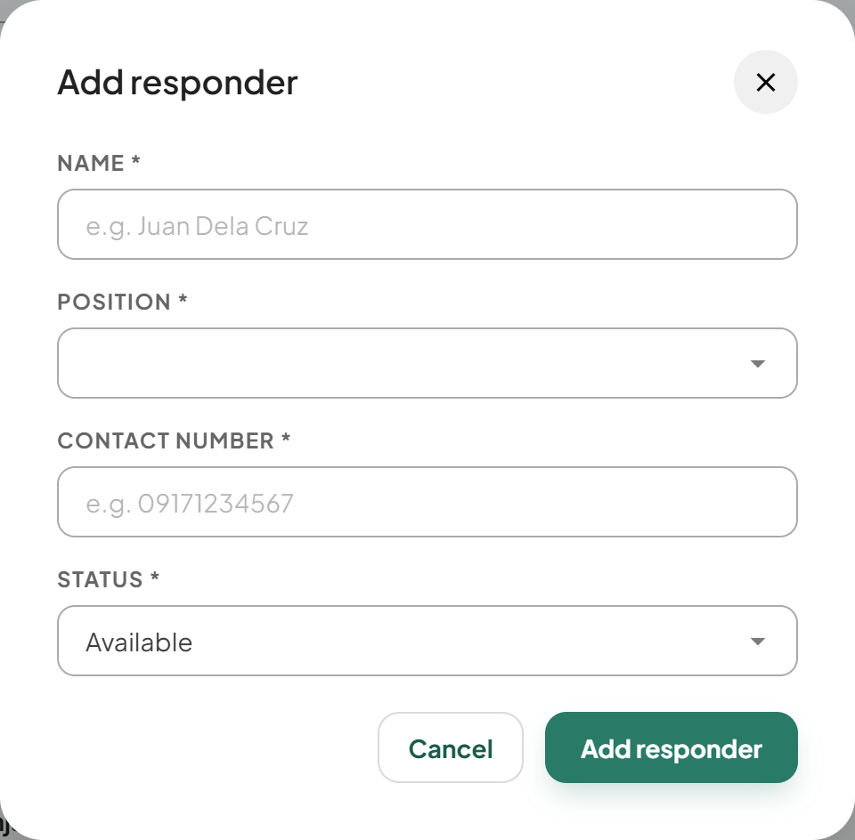

> **1** Full name
> **2** Role on the team
> **3** Mobile number
> **4** Save

## Add or update equipment

1. Click **Resource Management**.
2. Click **Add equipment**, or **Edit** on an item.
3. Type the item name and the total the office owns.
4. Set the status. **Unavailable** hides the item from residents.
5. Click **Add** or **Save**.

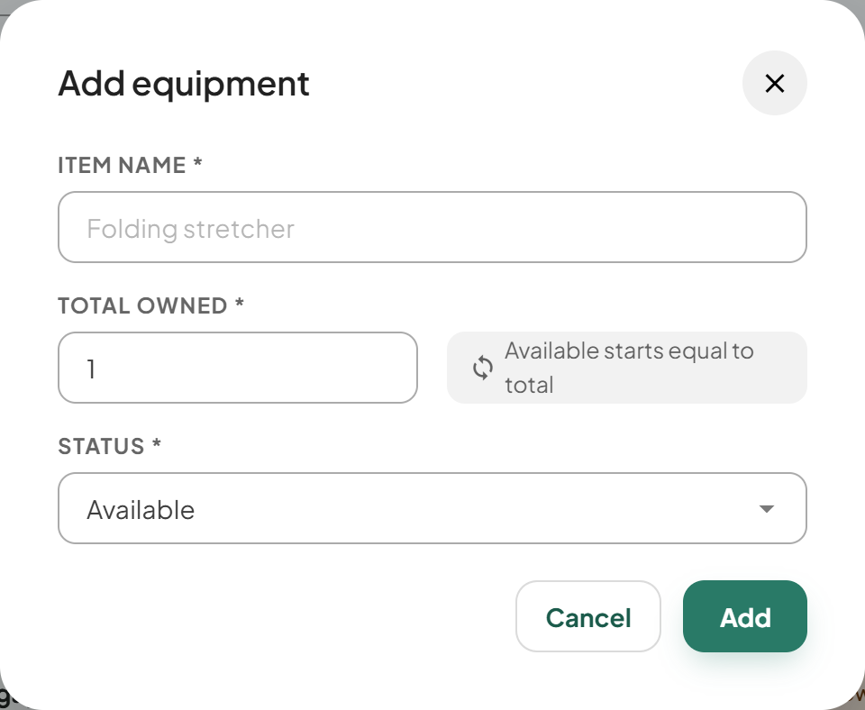

> **1** Name residents see
> **2** How many the office owns
> **3** Available or Unavailable
> **4** Save

## Check what to procure

**Procurement Reference** lists items residents asked for that the office does not lend.

1. Click **Procurement Reference**.
2. Filter by status, or click **Refresh**.

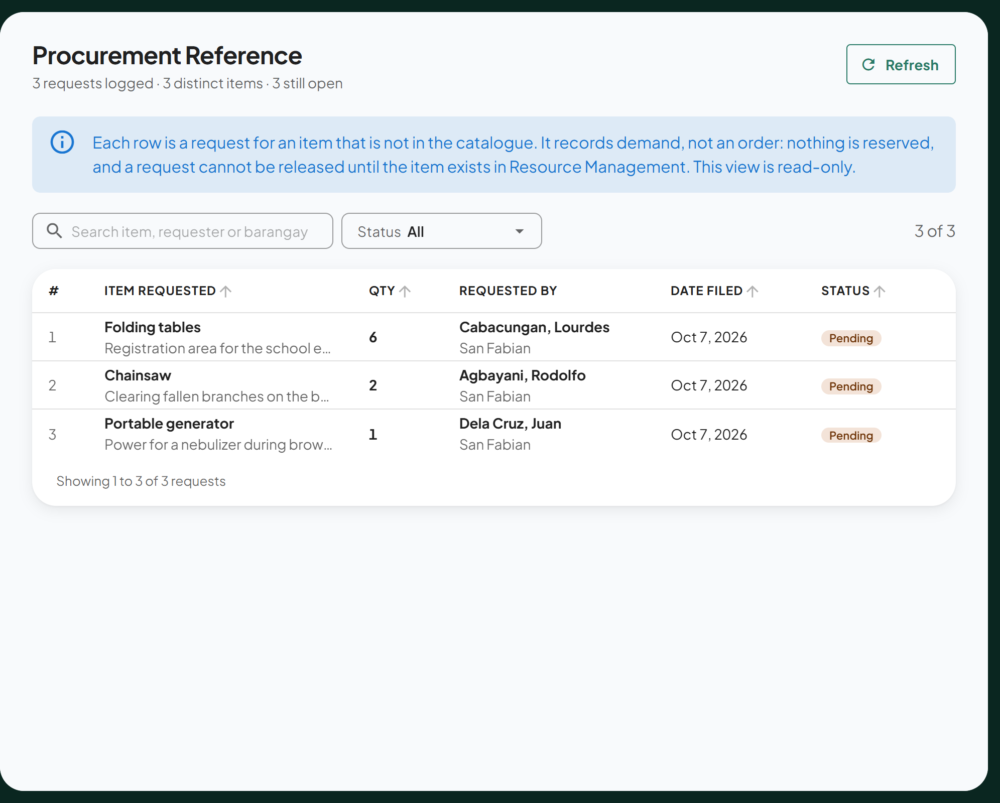

> **1** Limit the list
> **2** Reload it

# Work with residents

## Find an account

1. Click **Accounts**. A number beside it in the menu counts the accounts waiting for activation.
2. Search by name or mobile number, or filter by barangay and status. To see only the accounts waiting for you, set **Status** to **Pending**.
3. Click the account to open it.

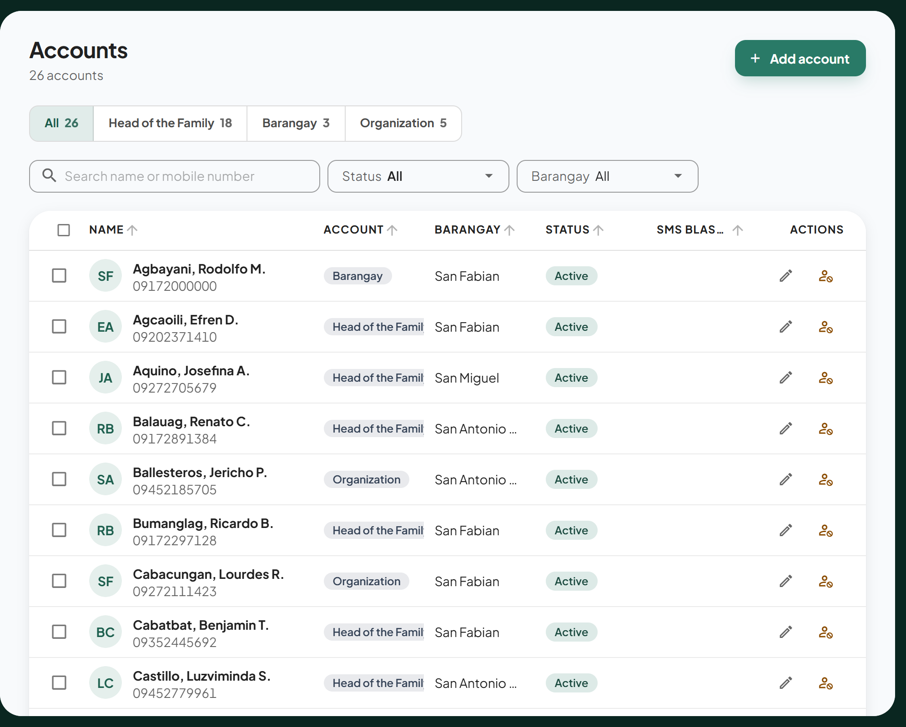

> **1** Find by name or number
> **2** Limit to one barangay
> **3** Active, pending or deactivated
> **4** Open the account

## Activate an organization

An organization cannot request services until MDRRMO activates it. Its status shows **Pending**. To find it, set **Status** to **Pending** on **Accounts**, or click **Pending accounts** on the dashboard.

1. Click the organization's account to open it.
2. Check its details.
3. Click **Approve organization**. To refuse it, click **Reject organization**.

The **Activate account** button on its row also approves it. Ticking it and clicking **Activate** in the selection bar does not: pending accounts are skipped there.

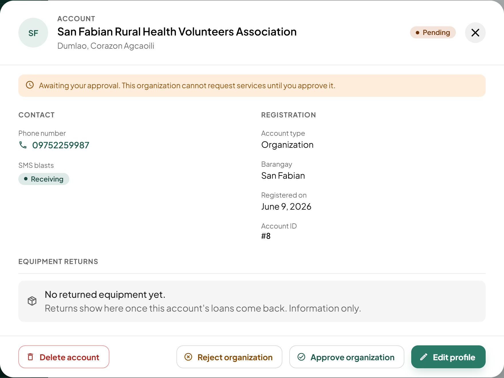

> **1** Waiting for approval
> **2** Let it request services
> **3** Refuse it

## Publish a document

Documents appear in the app's Safety library under MDRRMO documents.

1. Click **Documents**.
2. Click the upload area (**Upload a file**) and choose the file, or drop the file on it.
3. In **Title shown to residents**, type the title residents will see.
4. Click **Publish**.

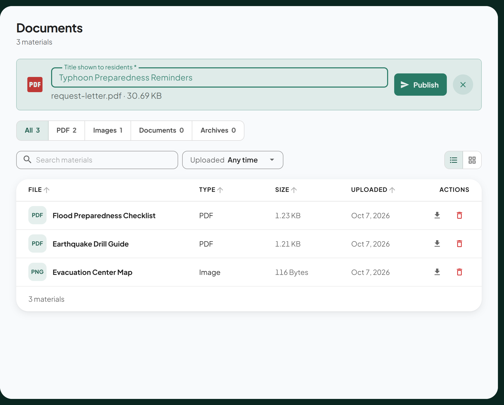

> **1** Name in the app's library
> **2** The chosen file
> **3** Publish it

## Send a text blast

A text blast is an SMS to residents who have text alerts turned on. For news that does not need a text, post an announcement instead.

1. Click **Text Blast (SMS)**. The **New blast** form is on the left.
2. Under **Target audience**, choose the barangays, or click **Select all**.
3. Optional: start from a template.
4. Type the message.
5. Check how many residents it reaches, shown under the message.
6. Click **Send blast**.

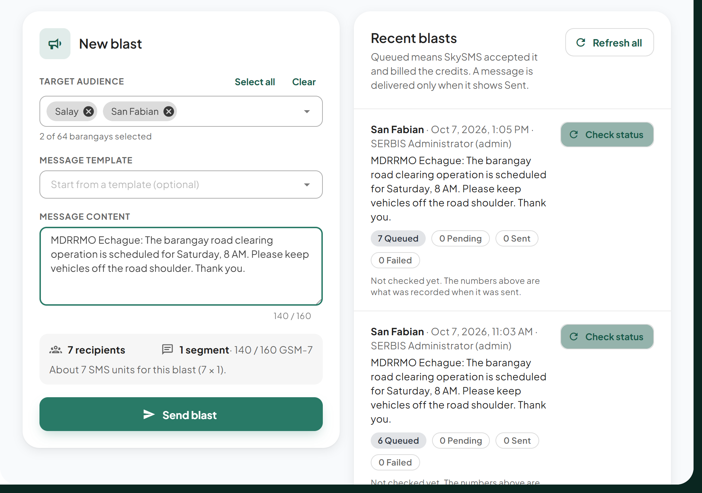

> **1** Start from a template
> **2** The text
> **3** Who receives it
> **4** Continue

7. Type the text blast code.
8. Click **Send blast** to send.

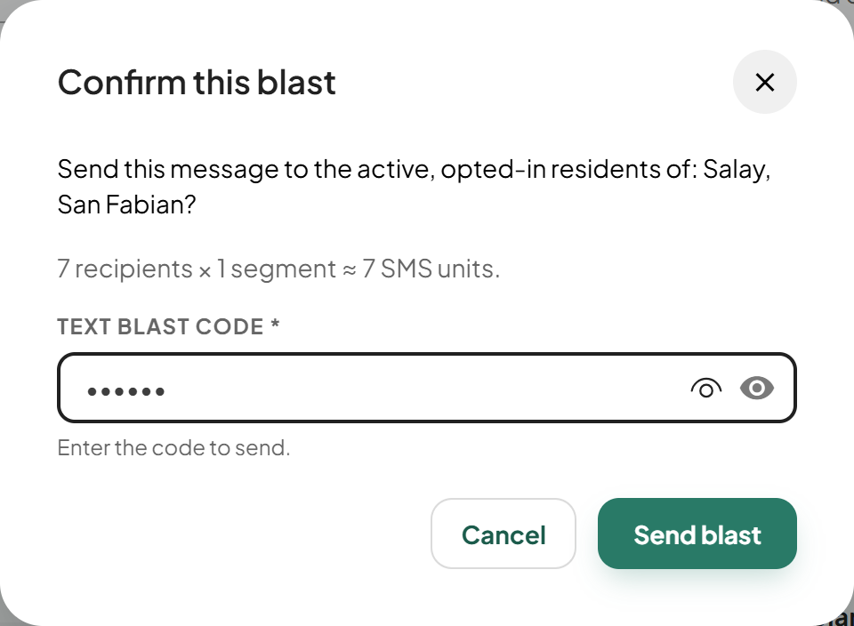

> **1** The code your office set
> **2** Send

Under **Recent blasts**, each blast counts its messages as Queued, Pending, Sent or Failed. A message has reached the phone only when it shows Sent. Each staff member can send up to 3 blasts an hour.

## Set the text blast code

1. Click **Text blast code** on the Text Blast page.
2. Type the current code, then the new 6-digit code.
3. Click **Set code**.

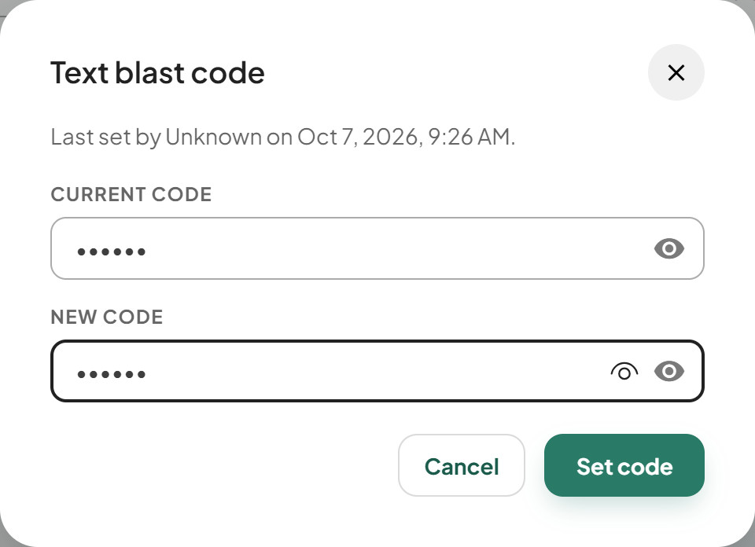

> **1** The code in use
> **2** The new code
> **3** Save it

# Configure the system

## Add, edit or disable a service

1. Click **Manage Services**.
2. Click **Edit** on a service.
3. Type the Filipino name and the description. A service's English name and category cannot be changed here.
4. Click **Save changes**.

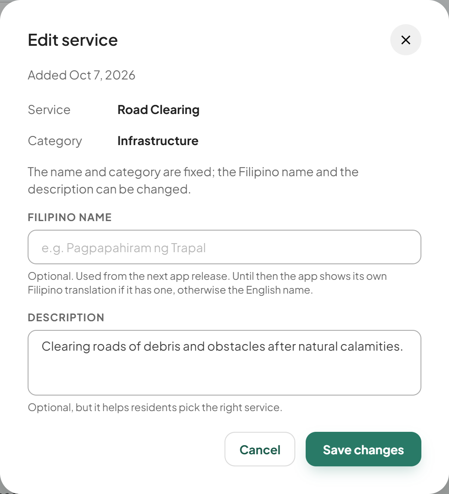

> **1** Filipino name
> **2** Helps residents pick the right service
> **3** Save

To add a service, click **Add service**. A new service is added switched off and uses the app's general form; residents see it after you set who can request it and click **Enable**. To hide a service from residents, click **Disable** on its row, then **Disable service**.

## Choose who can request a service

1. Click **Service Audience**.
2. Tick or untick the account types for each service. Each tick is saved at once.

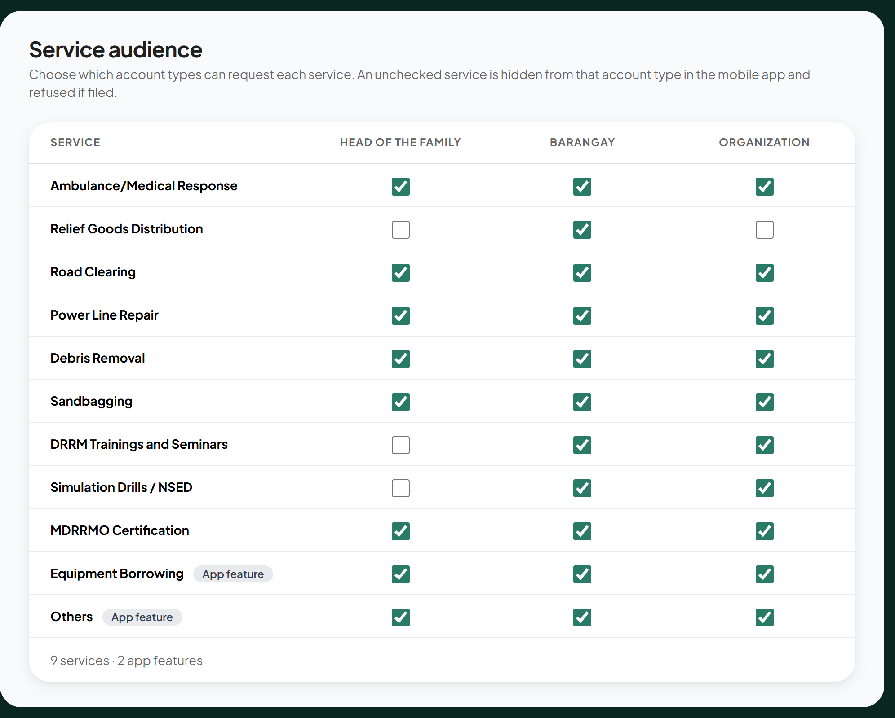

> **1** The service
> **2** Who may request it

## Choose vehicles for a service

1. Click **Service Vehicles**.
2. Tick the vehicle types offered when approving each service. Each tick is saved at once.

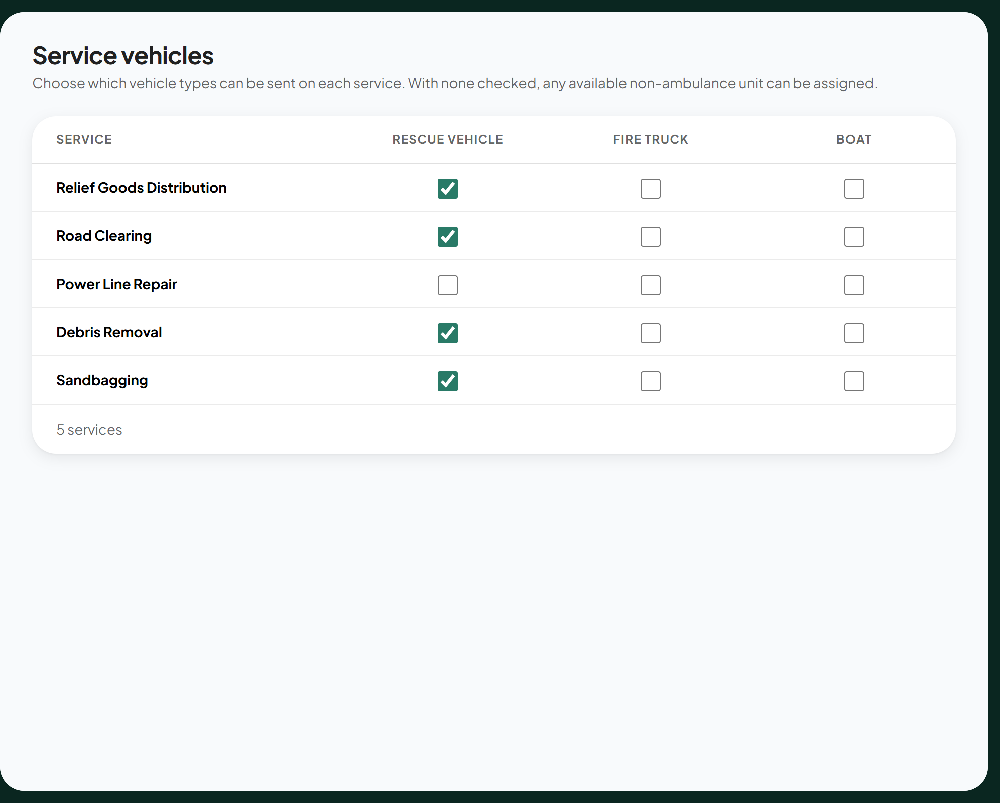

> **1** The service
> **2** Units offered when approving it

## Edit emergency hotlines

The hotlines appear in the app's Safety library and emergency bar.

1. Click **Emergency Hotlines**.
2. Click **Add hotline**, or **Edit** on a hotline.
3. Type the name in English and Filipino, and the numbers.
4. Click **Add hotline** or **Save changes**.

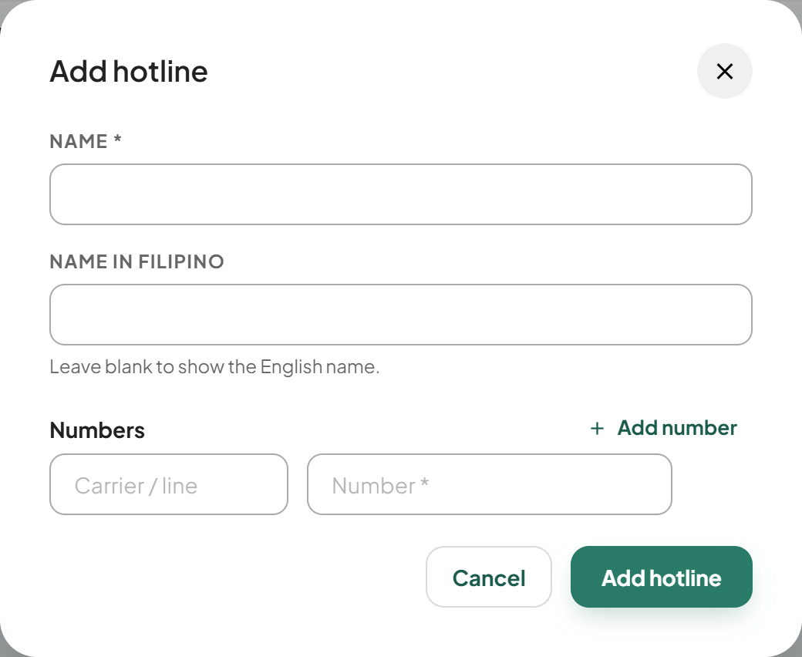

> **1** English name
> **2** Filipino name
> **3** One or more numbers
> **4** Save

# Manage staff (super admin only)

## Add a staff account

1. Click **Staff Accounts**.
2. Click **Add staff account**.
3. Type the name, username and mobile number.
4. Type a temporary password twice. It needs at least 8 characters, with upper and lower case letters and a number.
5. Click **Create account**.
6. Give the temporary password to the person directly. Like a reset password, it works only until they set their own at first sign-in.
7. A new account opens no pages. Give it access (see *Set what a staff member can open*).

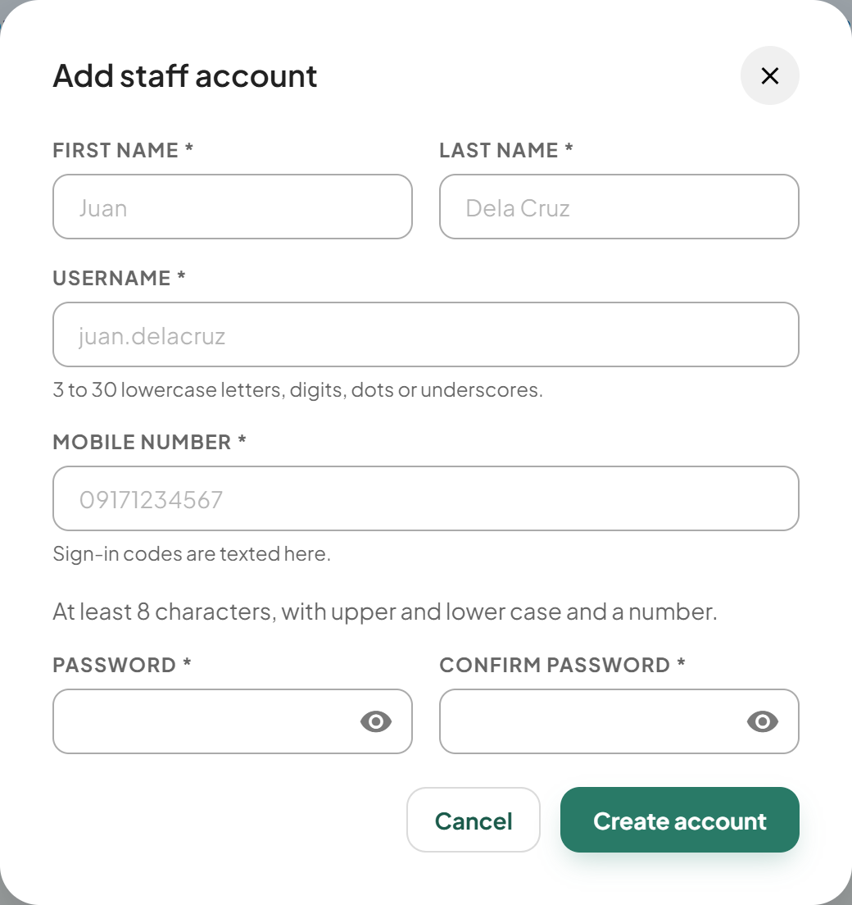

> **1** Their name
> **2** What they sign in with
> **3** For sign-in codes
> **4** Create the account

## Set what a staff member can open

1. Click the account's **More actions** menu, then **Manage access**.
2. Tick the pages they may open.
3. Turn on **Super admin** only for full access, including Staff Accounts.
4. Click **Save access**.

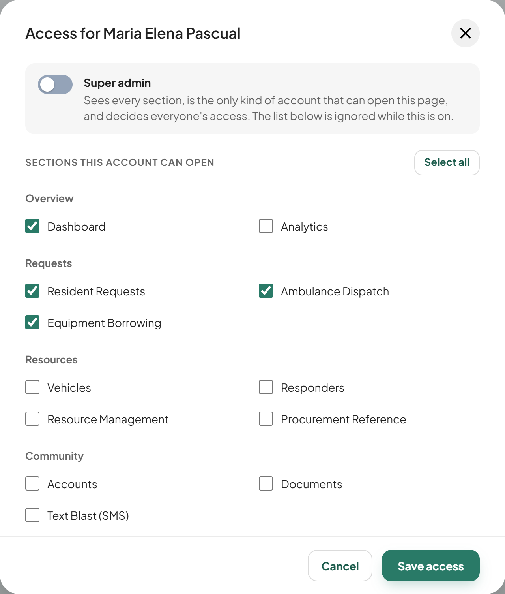

> **1** Pages they may open
> **2** Full access, including Staff
> **3** Save

## Reset a password or close accounts

1. Open the account's **More actions** menu.
2. Click **Reset password**, then **Reset password** again to confirm. The person is signed out everywhere.
3. Copy the temporary password and pass it on in person. It is shown only once. You cannot reset your own password this way.
4. To close accounts, tick them and click **Close accounts**, or click **Close account** in the More actions menu. You cannot close your own account or the only active super admin. Closed accounts can be reactivated later.

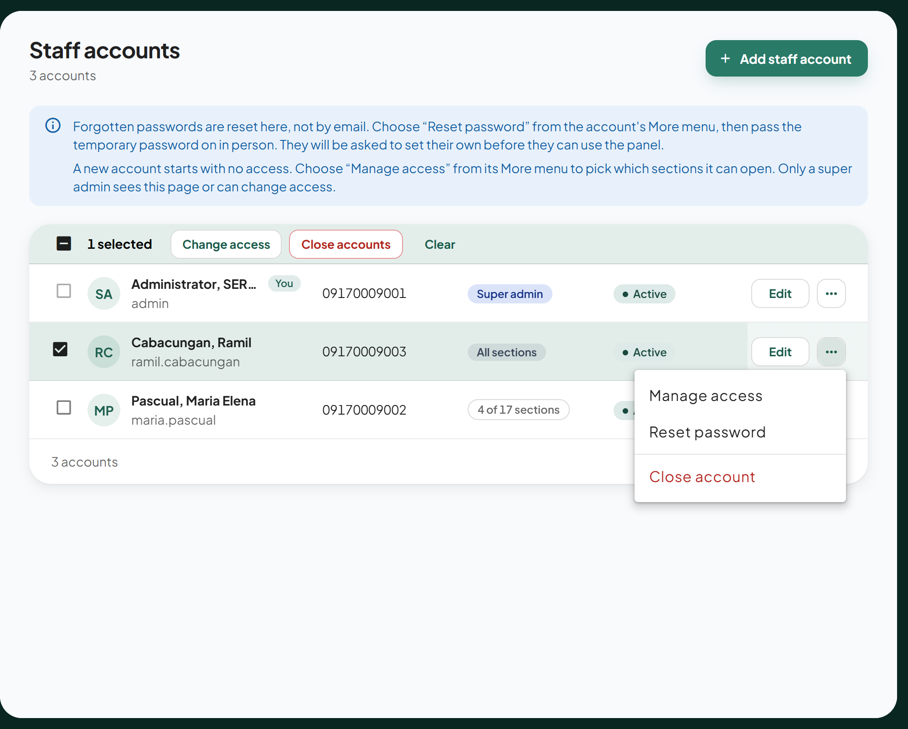

> **1** Actions for one account
> **2** New temporary password
> **3** Close the selected accounts

## Read the activity logs

1. Click **Activity Logs**.
2. Search by user or action.

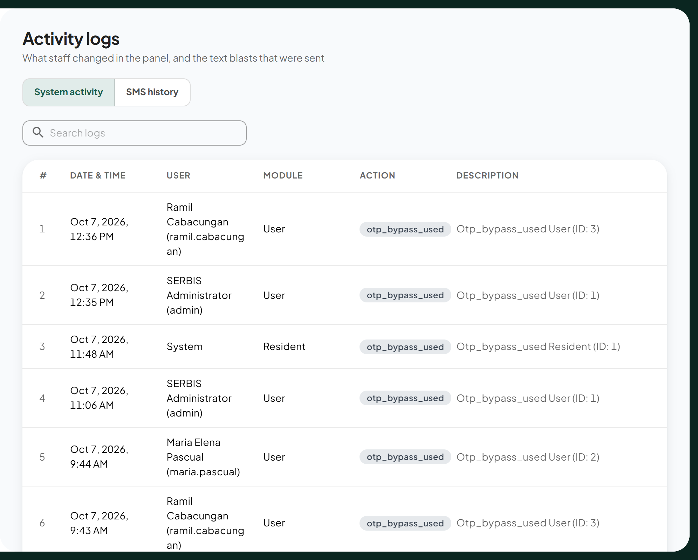

> **1** Find by user or action
> **2** Who did what, and when

# Common problems

**"LOCKED" on the Sign in button.** Too many sign-in attempts in a minute. Wait for the countdown, then try again.

**"This account has been deactivated. Contact another MDRRMO admin."** A super admin closed your account. Ask them to reactivate it.

**"Set a new password before continuing."** You are on a temporary password. Set your own password (see *Set your own password the first time*).

**"That code is not right, or it has expired. Ask for a new one."** The code was typed wrong or is too old. Click **Resend code** and type the newest code.

**"That login attempt has expired. Please log in again."** The code step stays open for 5 minutes. Sign in again with your username and password.

**"Too many wrong codes. Please log in again."** After 5 wrong codes the attempt is closed. Sign in again to get a new code.

**"Ask a super admin to add your mobile number."** Your account has no mobile number, so no code can be sent. Ask a super admin to add it in Staff Accounts.

**"We could not send the text message."** The text did not go out. Wait a minute and sign in again. If it keeps happening, contact a super admin.

**A page is missing from the menu.** You do not have access to it. Ask a super admin.

**A vehicle or responder cannot be deleted.** A vehicle cannot be deleted while it is dispatched, holds future bookings, or any request uses it; set it to **Maintenance** instead. A responder cannot be deleted while deployed on a request.
