<!--
SERBIS Mobile App User Manual. Source for tools/build.py.
Conventions: "# " starts a main section (new right-hand page), "## " a task.
An image line is followed by its legend: "> **N** caption" lines, one per box.
A "part-break" comment line splits the printed booklet into part 1 and part 2.
-->

# About this manual

This manual is for residents of Echague who use the SERBIS app to ask the MDRRMO for services, book patient transport, borrow equipment and read safety guides.

SERBIS is for non-emergency requests. **In an emergency, call the hotline.** The numbers are in the app's Safety library.

Each task has numbered steps. Red numbered boxes on a picture match the numbers in the legend under it.

**Account types.** What you can request depends on your account:

- **Head of the Family**: for a household.
- **Barangay**: for a barangay hall. MDRRMO creates these accounts.
- **Organization**: for a school, company or group. It can request services only after MDRRMO approves it.

Some services are only for certain account types. For example, relief goods are for barangay accounts, and trainings and drills are for barangays and organizations.

# Get started

## Install the app

SERBIS is not on the Play Store. Organizations wait for MDRRMO to activate the account before filing requests.

1. Open https://serbis-landing-page.vercel.app/ on your Android phone.
2. Tap **Download APK** and wait for the file to finish.
3. Open the file from your notifications or Downloads.
4. If the phone asks, allow installs from this source.
5. Open SERBIS and create your account.

## Create an account

1. Tap **Register**.
2. Under **Registering as**, choose **Head of the Family** or **Organization**.
3. Type your name and mobile number. An organization also types its name, and the name of its contact person.
4. Tap **Next: Where you live**.

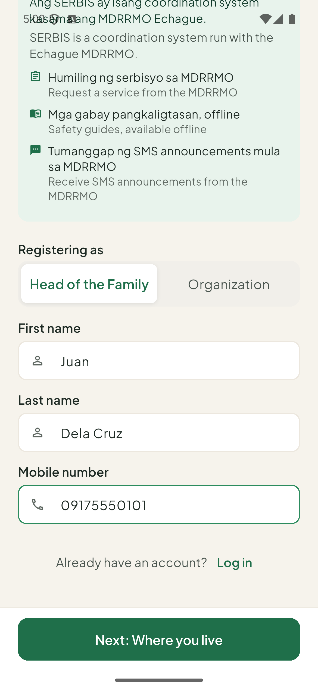

> **1** Head of the Family or Organization
> **2** Your name
> **3** Your mobile number
> **4** Go on

5. Choose your barangay and type your street or purok.
6. Tap **Next: Password and review**.

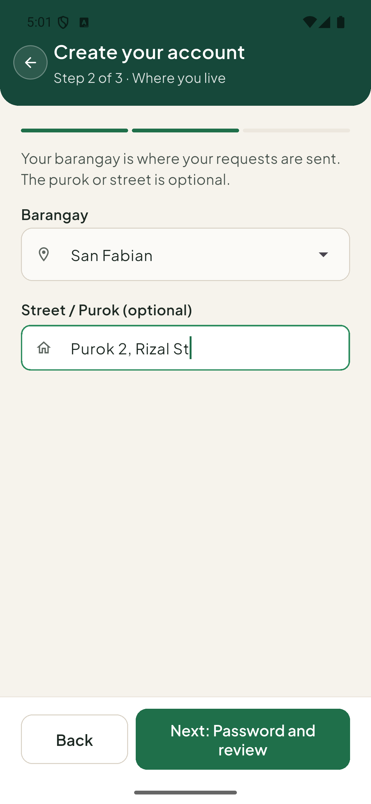

> **1** Where you live
> **2** Street or purok
> **3** Read this before you choose

7. Type a password twice. It needs at least 8 characters, with upper and lower case letters and a number, for example Pasada123.
8. Check your details.
9. Tap **Create account**.

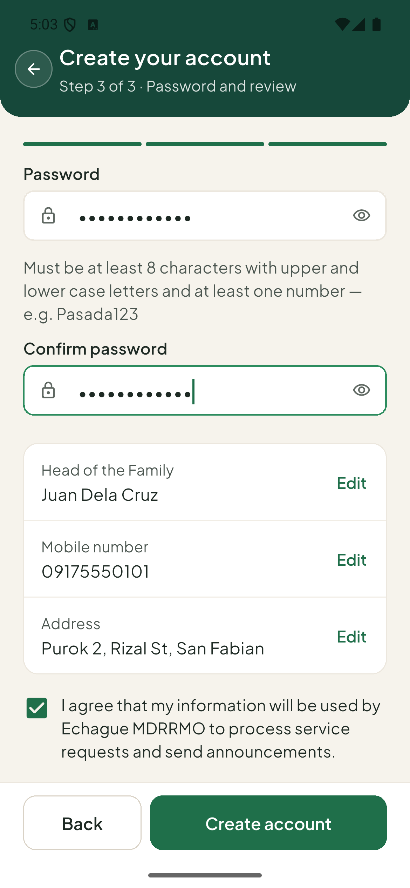

> **1** At least 8 characters
> **2** Type it again
> **3** Check your details
> **4** Finish

## Confirm your mobile number

SERBIS texts a 6-digit code to your number. The screen is called **Check your messages**.

1. Type the code.
2. Tap **Verify**.

If the text does not come, wait for **Resend code in …** to count down 60 seconds, then tap **Send a new code**. If you typed the wrong number, tap **Back to log in** and register again.

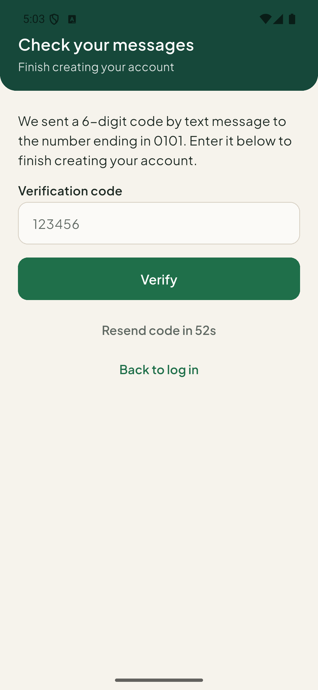

> **1** The 6-digit code
> **2** Confirm your number
> **3** Ask for a new code when it reaches 0
> **4** Wrong number? Start again

## Log in

1. Type your mobile number and password.
2. Tap **Log in**.

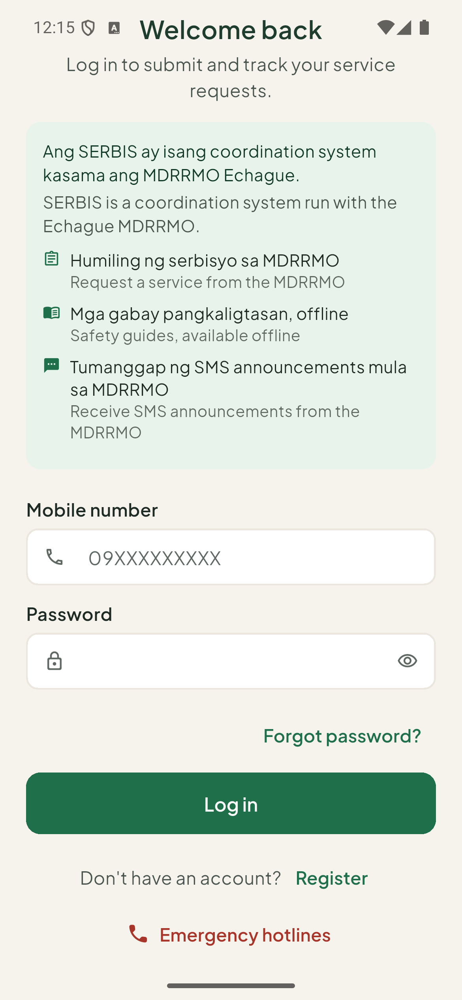

> **1** Your number
> **2** Your password
> **3** Log in
> **4** Reset your password
> **5** Make a new account

3. On **Check your messages**, type the code texted to you.
4. Tap **Verify**.

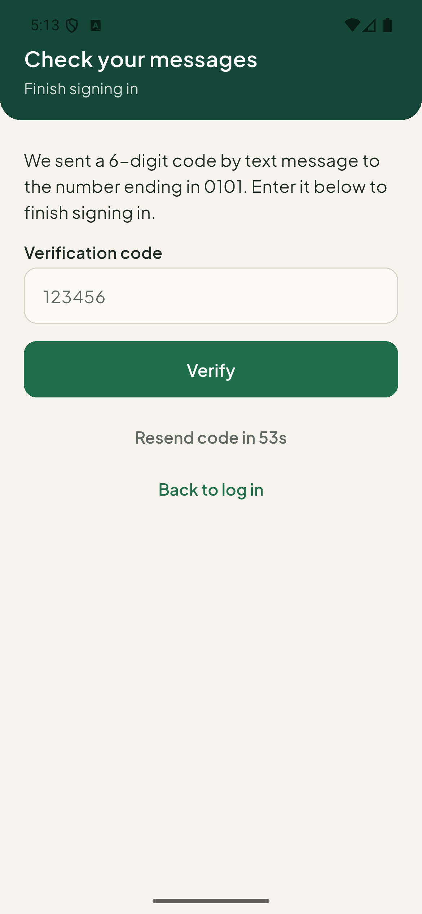

> **1** The code from the text message
> **2** Finish

## Call a hotline before you log in

You can see the hotlines without an account.

1. On the log in screen, tap **Emergency hotlines**.
2. Tap a number to call it.

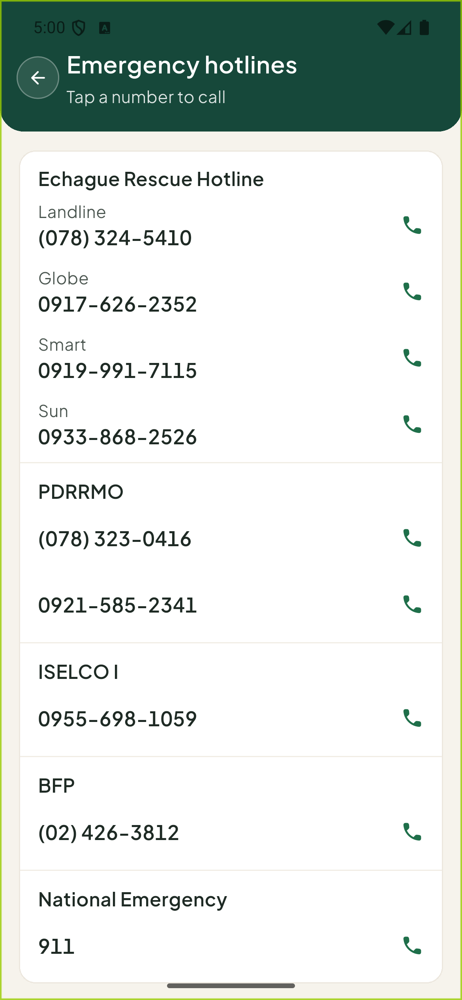

> **1** Who you are calling
> **2** Tap to call

## Reset a forgotten password

1. Tap **Forgot password?** on the log in screen.
2. Type your mobile number and tap **Send code**.
3. On **Check your messages**, type the code and tap **Verify**.
4. On **Choose a new password**, type your new password twice.
5. Tap **Change password**.

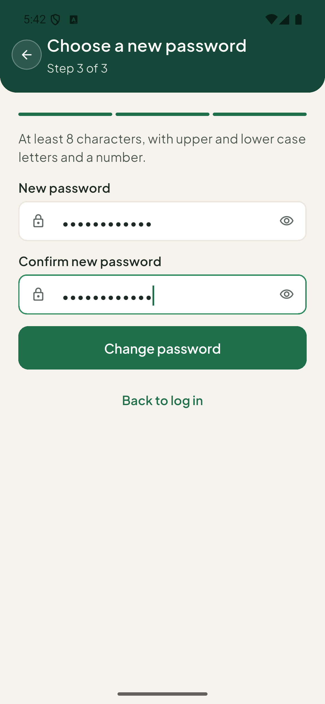

> **1** Your new password
> **2** Type it again
> **3** Save it

## If your organization is waiting for approval

A new organization account shows **Awaiting MDRRMO approval** until the MDRRMO activates it.

1. Tap **Check again** to see if it has been approved.

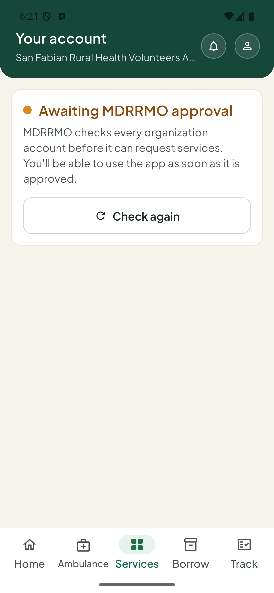

> **1** MDRRMO is checking your account
> **2** See if it is approved

# Find your way around

## The Home screen

Home shows your newest open request, shortcuts to common services, and announcements from the MDRRMO. The tabs at the bottom are **Home**, **Ambulance**, **Services**, **Borrow** and **Track**.

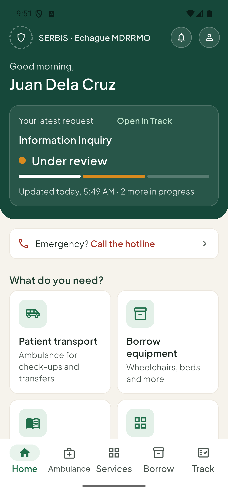

> **1** Your newest open request
> **2** Shortcuts
> **3** Notifications
> **4** Main parts of the app

The request panel is hidden when you have nothing open.

## Call the MDRRMO from Home

1. Tap **Emergency? Call the hotline** at the top of Home. Your phone opens the MDRRMO number, ready to call.

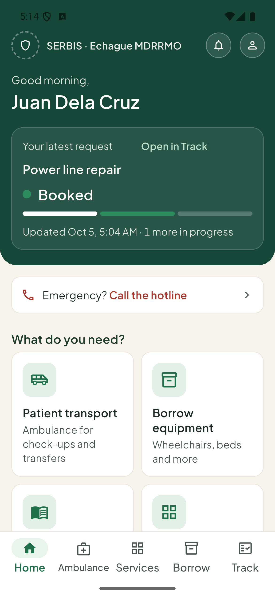

> **1** Call the MDRRMO

## When a tab says Not available

A tab shows **Not available** and **Not offered right now** when the MDRRMO does not offer that part of the app to your account type. For example: **Ambulance booking is not offered to this account type.** The MDRRMO decides which account types may use each service. If you think your account should have it, contact the MDRRMO.

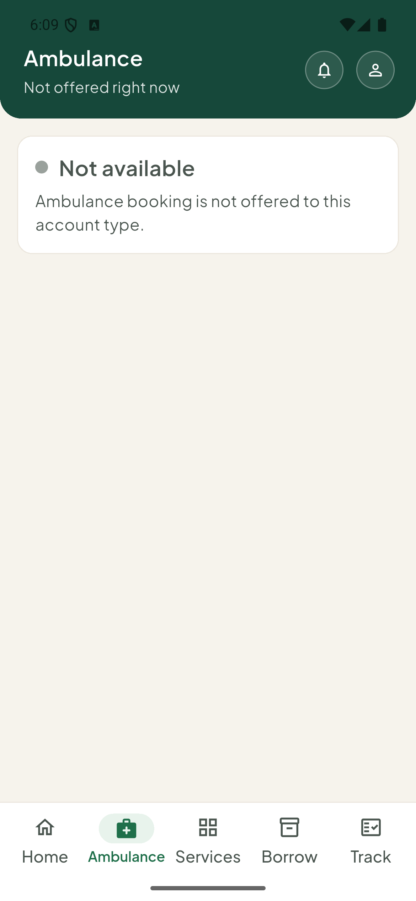

> **1** Not offered to your account type
> **2** Why

## Notifications

1. Tap the bell at the top.
2. Read the updates. MDRRMO advisories come first, then updates on your requests from the last 30 days. New ones are marked **New**; older ones are under **Earlier**.

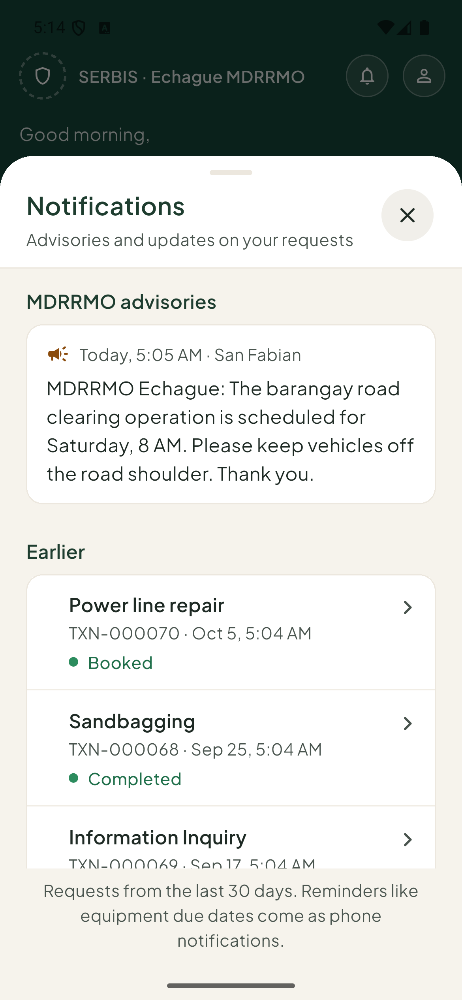

> **1** Older updates
> **2** A notice from MDRRMO

# Ask for a service

## Choose a service

1. Tap **Services**.
2. Tap the service you need.

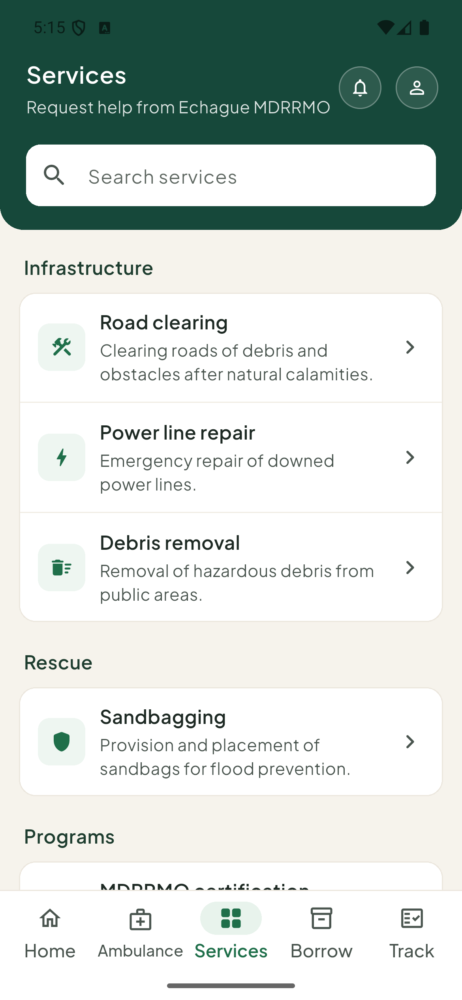

> **1** Services are grouped
> **2** Open a service

## Fill in the form

1. Fill in every field marked with a red star.
2. Add a photo of the place if the form asks for one.
3. Tap **Send request**.

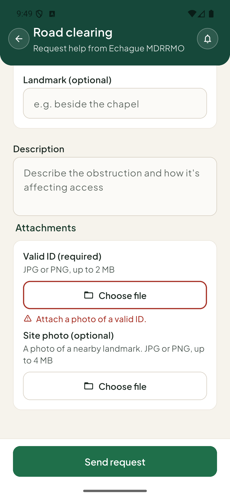

> **1** Photo of a valid ID (required)
> **2** Photo of the place (optional)
> **3** Send

If something is missing, the form lists how many fields need attention and marks each one in red.

## Relief goods (three steps)

1. Fill in each step.
2. Tap **Next: …** to go on, or **Back** to change an earlier step. The steps are Household, Assistance and delivery, and ID and review.
3. Tap **Send request** on the last step.

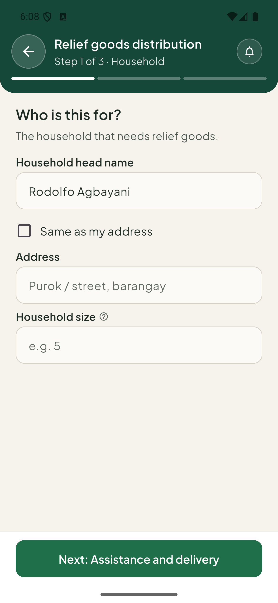

> **1** Where you are in the form
> **2** About your household
> **3** Go on

## Trainings, seminars and drills

These are for barangay and organization accounts. The **Simulation Drills / NSED** form works the same way.

1. Choose the date you want.
2. Attach your request letter. It is required.
3. Tap **Send request**.

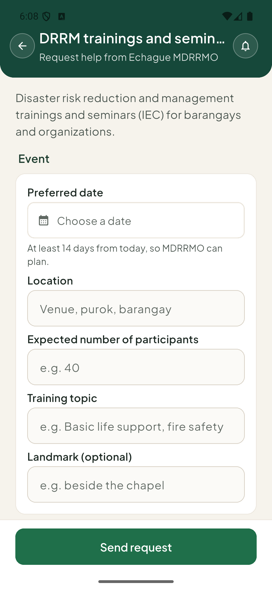

> **1** When you want it
> **2** Send

## Certification

1. Say what the certification is for.
2. Attach a letter if you have one. It is optional.
3. Tap **Send request**.

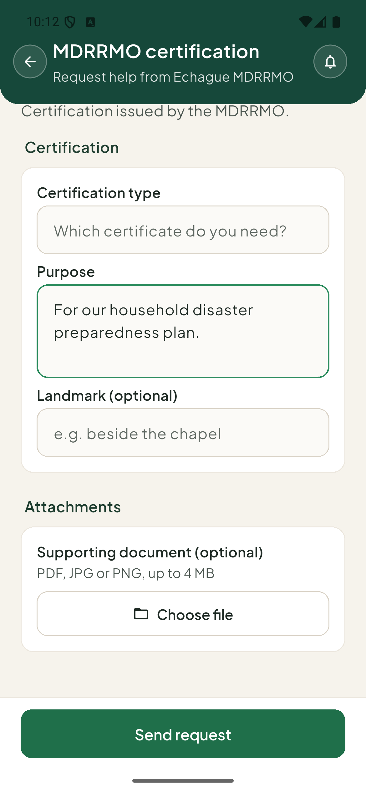

> **1** What the certification is for
> **2** Attach a letter if you have one

## Other requests

Use **Others** when your need is not on the list.

1. Describe what you need.
2. Add a photo of a valid ID.
3. Tap **Send request**.

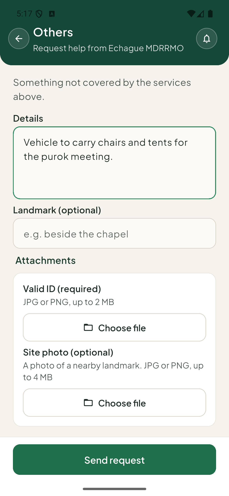

> **1** Say what you need

## After you send

The app shows **Request sent** with your reference number.

1. Tap **View in Track** to follow it, or **Done** to close.

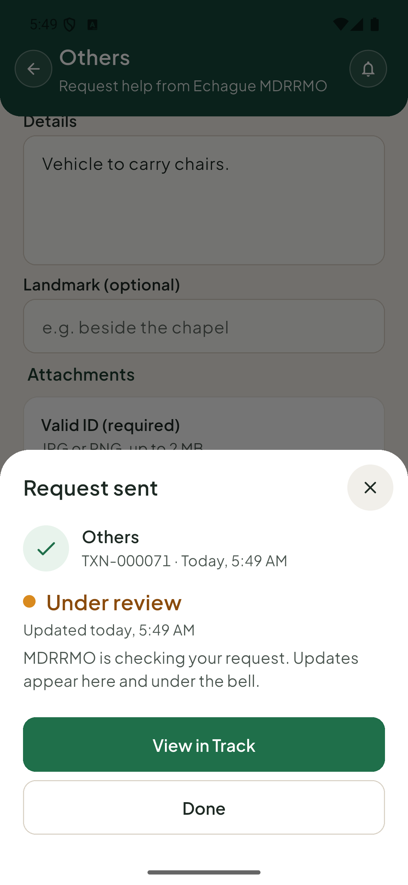

> **1** Keep this number
> **2** Follow the request
> **3** Close

# Book an ambulance

Use the **Ambulance** tab to book patient transport, for example for a check-up, dialysis or a transfer between hospitals. The booking has five steps: Patient, Trip, Condition, Schedule and ID, and Review. This is not an emergency service. In an emergency, call the hotline.

## Patient

1. Tap **Ambulance**.
2. Type the patient's name, age and other details.
3. Tap **Next: Trip**.

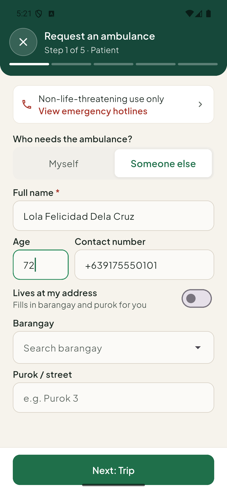

> **1** Step 1 of 5
> **2** Who will ride
> **3** Their age
> **4** Go on

## Trip

1. Leave **Pick up at my address** on to use your saved address, or turn it off and type the pickup place.
2. Choose the destination from the list, or type it.
3. Tap **Next: Condition**.

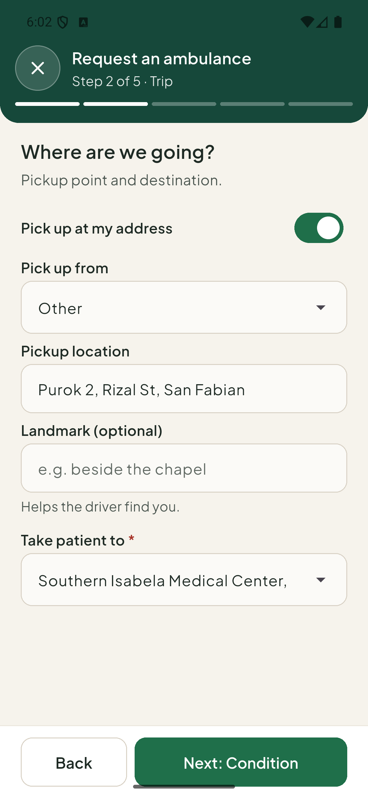

> **1** Pickup place
> **2** Destination
> **3** Go on

## Condition

1. Say why the patient needs transport.
2. Add the relatives who will come along.
3. Tap **Next: Schedule and ID**.

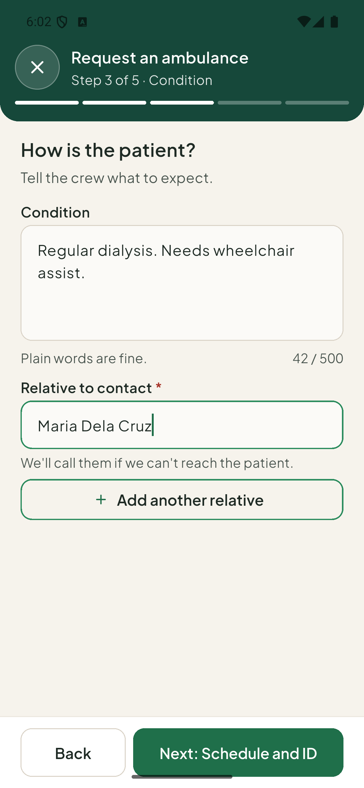

> **1** Why the patient needs transport
> **2** Who will come along

## Schedule and ID

1. Choose **Now, when available**, or **Scheduled** and pick a date and time.
2. Check the note on whether a unit looks free. The MDRRMO confirms the unit and time.
3. Add a photo of a valid ID.
4. Tap **Next: Review**.

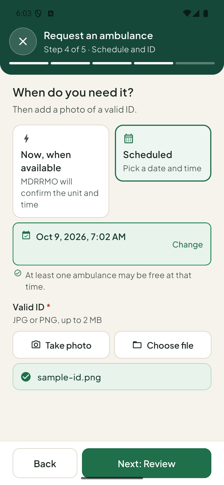

> **1** Now or a set time
> **2** When to pick up
> **3** Whether a unit looks free
> **4** Photo of a valid ID

## Review and send

1. Check your answers. To change a part, tap its **Edit** link.
2. Tap **Send request**.

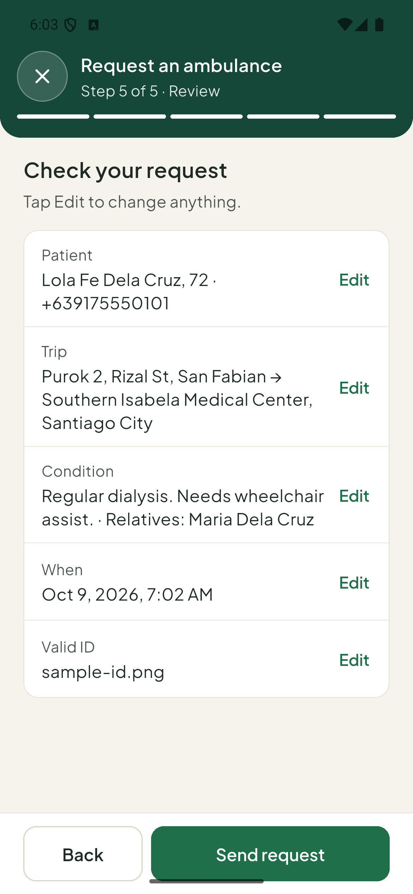

> **1** Check your answers
> **2** Change a step
> **3** Send

## Leaving the form

If you close the form before sending, the app asks **Discard this request?** Tap **Discard** to leave and clear your answers, or **Keep editing** to stay.

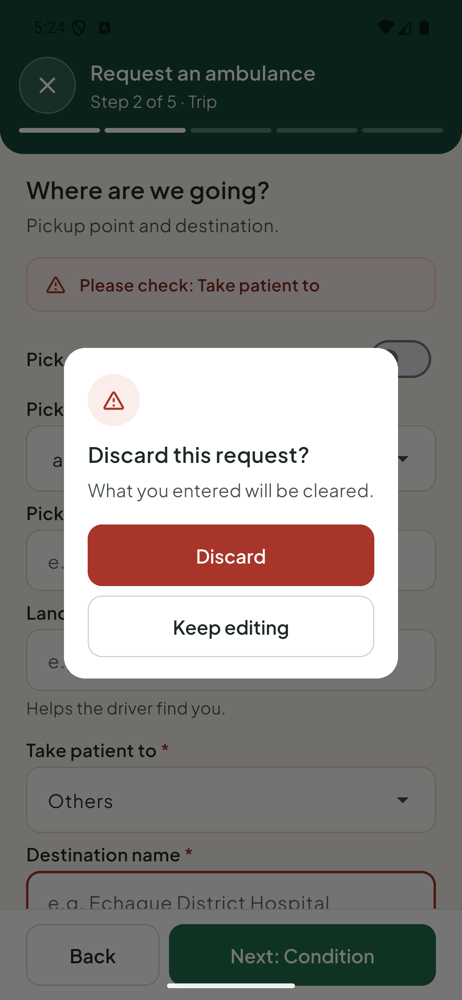

> **1** Leave and delete your answers
> **2** Stay on the form

<!-- part-break -->

# Follow your requests

## See all your requests

1. Tap **Track**.
2. Open requests are under **In progress**. Finished ones are under **Past requests**.

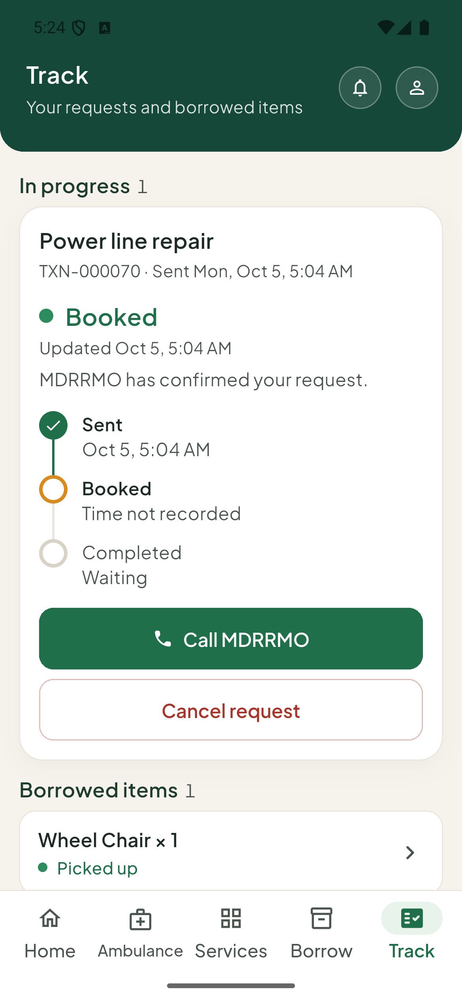

> **1** Requests still open
> **2** Where it stands
> **3** When it last changed

Each request shows one status:

- **Under review**: the MDRRMO is checking it.
- **Booked**: an ambulance booking holding its date and time. The MDRRMO assigns a unit before the trip.
- **Responding**: the team is working on it.
- **Approved**: for trainings, drills and certifications.
- **Completed**: done.
- **Not transported**: the ambulance trip did not carry the patient. The reason is shown.
- **Not approved**: the MDRRMO could not approve it. The reason is shown.
- **Cancelled by you**: you withdrew it.

## Borrowed items in Track

Items you have borrowed and not yet returned are listed in Track under **Borrowed items**.

1. Tap **Track**.
2. Tap an item under **Borrowed items**. Borrow opens on **My requests**.

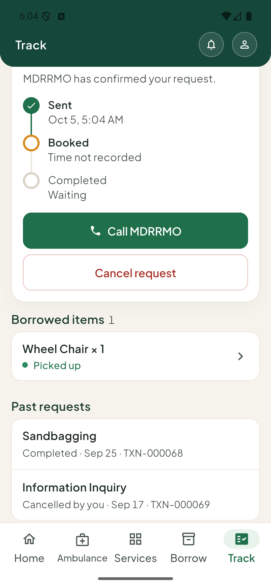

> **1** Items you have out
> **2** Open it in Borrow

## Open a request

1. Tap the request.
2. Read the status, the steps and what happens next.

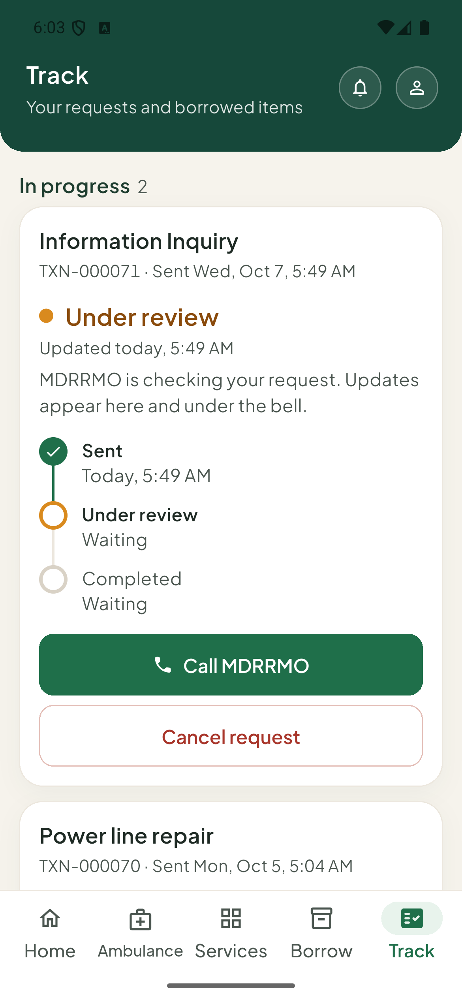

> **1** Where it stands
> **2** Steps done and to come
> **3** What MDRRMO does next
> **4** Withdraw it

## Cancel a request

You can cancel a request while it is **Under review** or **Booked**. A booking cannot be cancelled in the last 2 hours before its time, or once the unit has left; call the office instead. If the button is not shown, it can no longer be cancelled.

1. Tap **Cancel request**.
2. The app asks **Cancel request?** Tap **Cancel request** to confirm, or **Keep request** to go back.

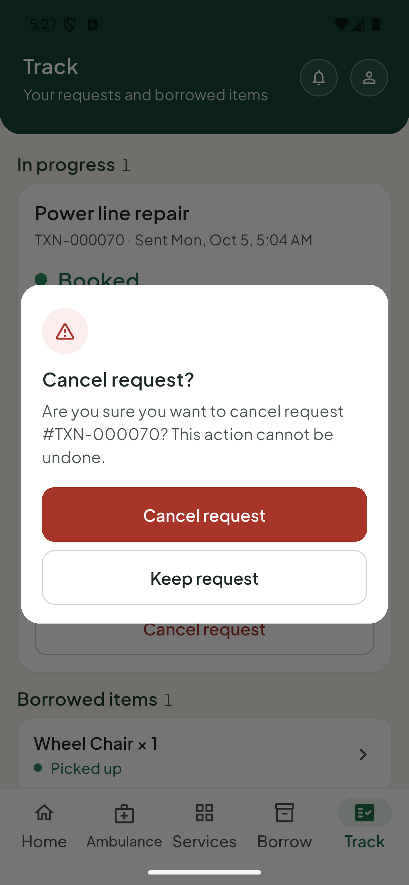

> **1** Withdraw it
> **2** Go back

# Borrow equipment

## Find an item

1. Tap **Borrow**.
2. Search for the item, or scroll the list. Each item shows how many are free.

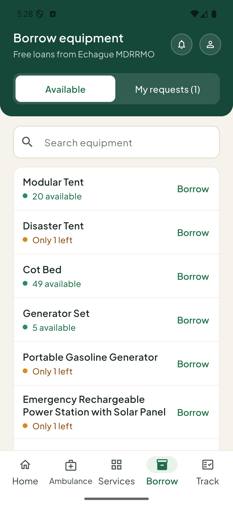

> **1** Find an item
> **2** How many are free
> **3** Ask to borrow it

## Borrow an item

1. Tap **Borrow** next to the item.
2. Set how many you need. You can ask for up to the number available.
3. Say what it is for.
4. Choose **Pickup** at the MDRRMO office or **Delivery** to your address. For delivery, type the address.
5. Tap **Send request**.

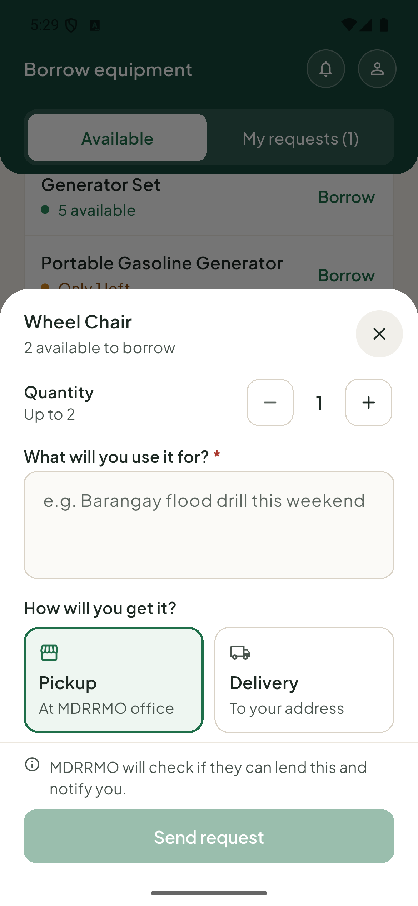

> **1** How many
> **2** How you get it
> **3** What it is for
> **4** Send

## Ask for an item not on the list

1. Tap **Need something else?** at the end of the list. The **Request another item** sheet opens.
2. Type the item and how many, say what it is for, and choose pickup or delivery.
3. Tap **Send request**.

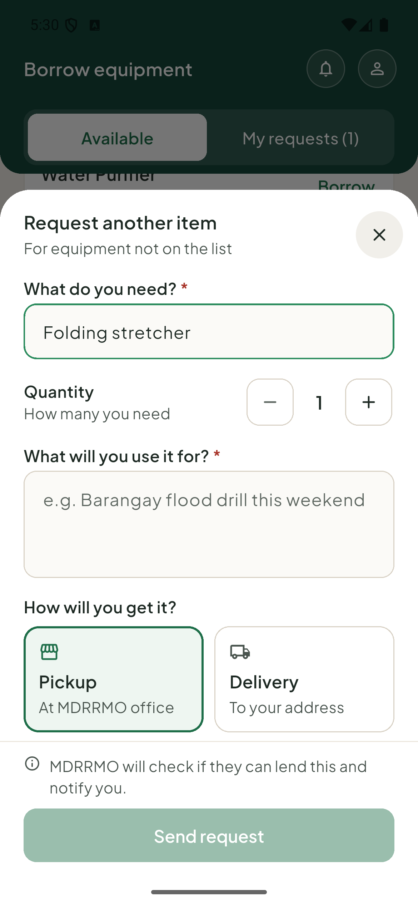

> **1** What you need
> **2** How many
> **3** Send

## Follow your borrowing

1. Open **My requests** on the Borrow screen.
2. Check the status and the date to return the item.

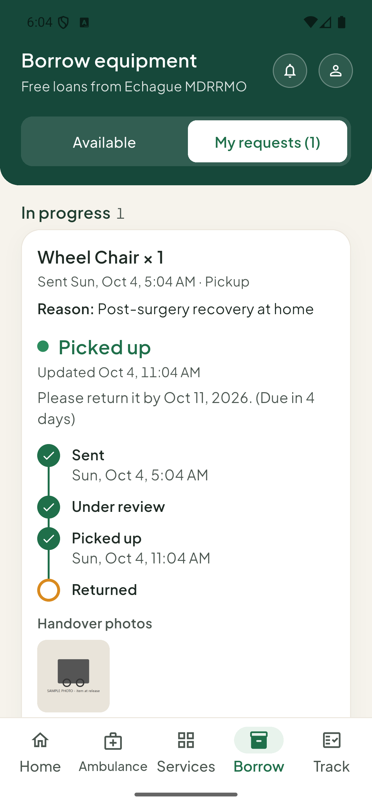

> **1** Where it stands
> **2** When to bring it back
> **3** Photos taken at the counter

A borrowing request goes **Under review**, then **Ready to pick up** or **Out for delivery**, then **Picked up** or **Delivered**, and ends **Returned**. If the MDRRMO cannot lend it, it shows **Not approved** with the reason. You can tap **Cancel request** until the item is released to you.

# Safety guides and hotlines

## Read a guide

1. On Home, tap **Safety guides**.
2. Tap a guide to read it.
3. Tap **Download** to keep it on your phone. It then shows **Saved**.

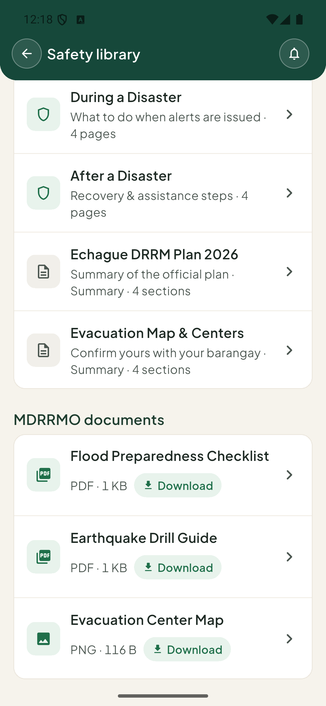

> **1** Open a guide
> **2** Keep it on your phone

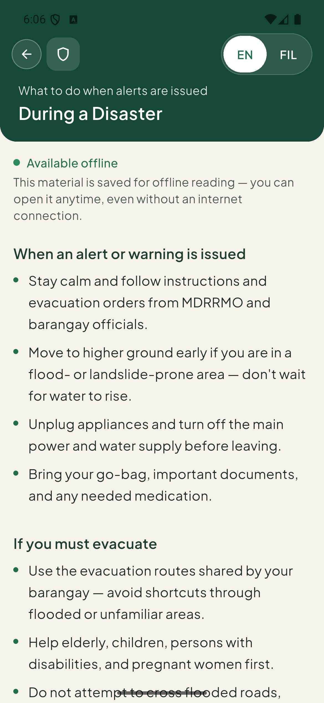

> **1** The guide
> **2** Return to the library

## Read a guide without internet

1. In the Safety library, tap **Download** on a guide. It then shows **Saved**.
2. Later, even without internet, tap the profile button at the top.
3. Tap **Offline materials**.
4. Tap the guide to read it.

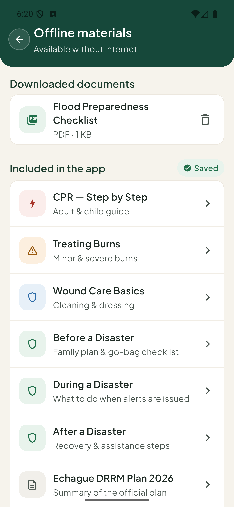

> **1** Guides you downloaded
> **2** Guides that come with the app

## Call a hotline

1. Tap **Emergency hotlines** in the Safety library.
2. Tap a number to call it.

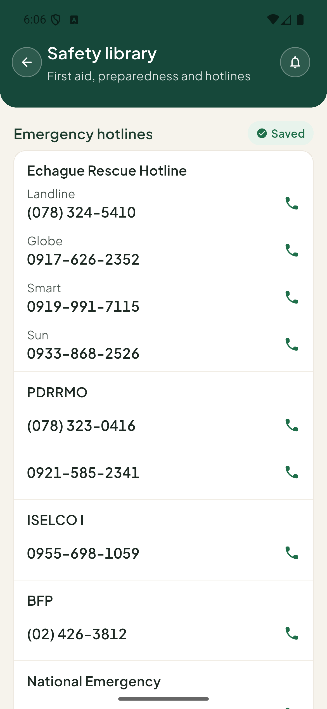

> **1** Who you are calling
> **2** Tap to call

# Your profile

## Open your profile

1. Tap the profile button at the top.

> **1** Your number and barangay
> **2** Name and address
> **3** Turn text alerts on or off
> **4** English or Filipino
> **5** Saved guides
> **6** Sign out

Keep **MDRRMO text alerts** on to receive flood and evacuation texts from the MDRRMO. While your account is pending, the profile shows **Text alerts start once MDRRMO activates your account.**

## Edit your details

1. Tap **Edit my details**.
2. Change your name or address.
3. Tap **Save changes**. If you changed your barangay, the app asks **Change your barangay?** Tap **Change barangay**. Requests you already sent stay with the old barangay.

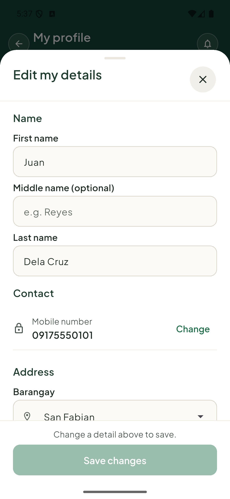

> **1** Your name
> **2** Where you live now
> **3** Save

A Head of the Family can change barangay here after moving. Barangay and organization accounts cannot. They must contact the MDRRMO.

## Change your mobile number

1. Tap **Edit my details**, then **Change** next to your mobile number.
2. Type the new number and your current password.
3. Tap **Send code**.
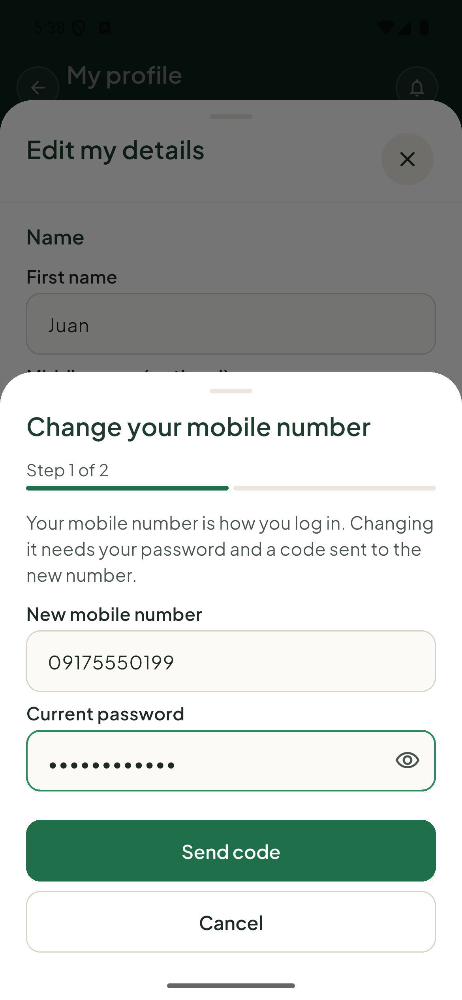

> **1** Your new number
> **2** To prove it is you
> **3** Get a code on the new number

4. On **Enter the code**, type the code sent to the new number.
5. Tap **Confirm new number**. You now log in with the new number.

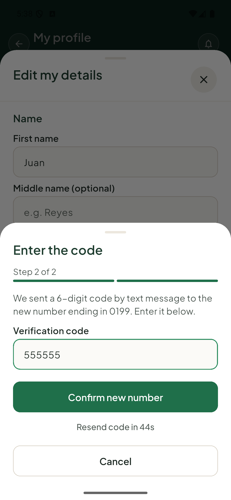

> **1** The code sent to the new number
> **2** Ask for a new code
> **3** Finish the change

## Change the language

1. Tap **Language**.
2. Choose **English** or **Filipino**.

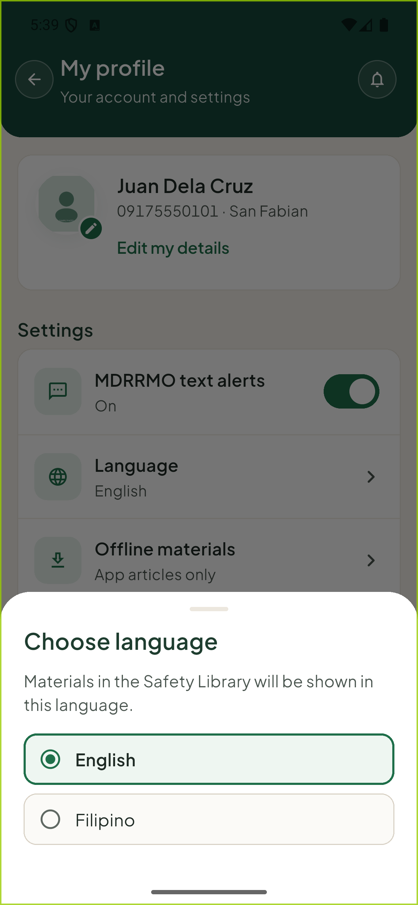

> **1** English
> **2** Filipino

## Change your profile photo

1. Tap your photo or initials at the top of your profile.
2. Tap **Choose a photo** and pick a picture. To take it off, tap **Remove photo**.

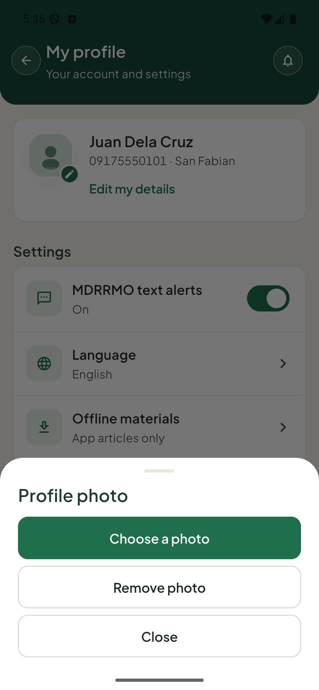

> **1** Pick a new picture
> **2** Take the photo off

## Contact the MDRRMO

1. Tap **Contact MDRRMO** on your profile. Your phone opens the MDRRMO number, ready to call.

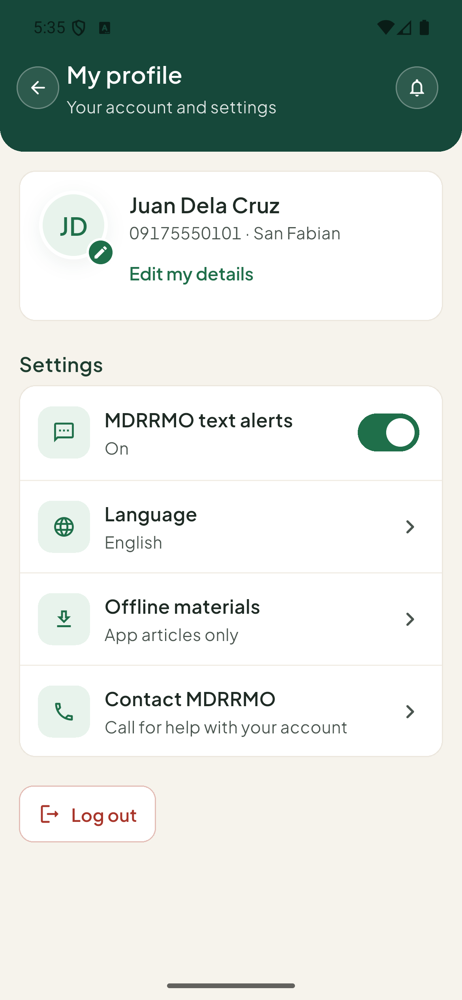

> **1** Call for help with your account

## Log out

1. Tap **Log out** at the bottom of your profile.
2. The app asks **Log out?** Tap **Log out** to confirm.

# Common problems

**You are offline.** A bar at the top says **No connection to MDRRMO. Requests can't be sent.** and shows when the data was last updated. You can read saved requests and guides, but you cannot send anything until you are back online.

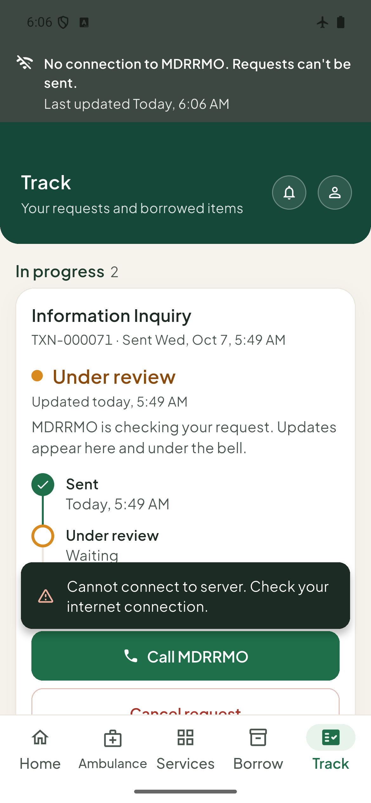

> **1** You are offline
> **2** How old the shown data is

**A list could not load.** Check your connection, then tap **Try again**.

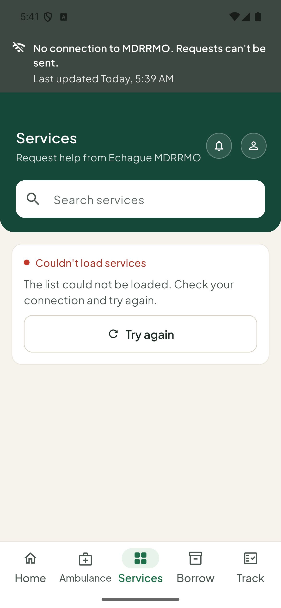

> **1** What went wrong
> **2** Load it again

**The text-message code did not arrive.** Wait for the countdown to reach 0, then tap **Send a new code**. Check that the number is right.

**A service is not on the list.** It is not offered for your account type, or the MDRRMO has turned it off.

**"Your organization account is awaiting MDRRMO approval."** You can request services after the MDRRMO activates your account.

**"This account has been deactivated. Please visit the MDRRMO office."** Visit or call the MDRRMO.

**The app asks you to update.** Install the newest version of the app, then open it again.
